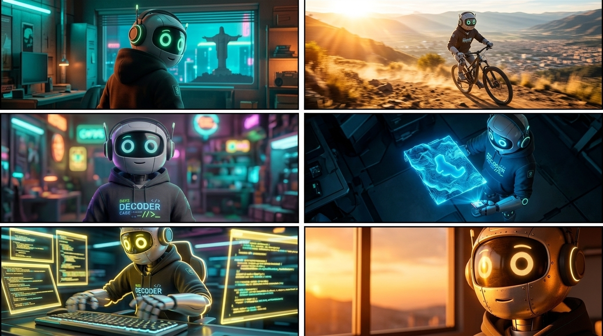
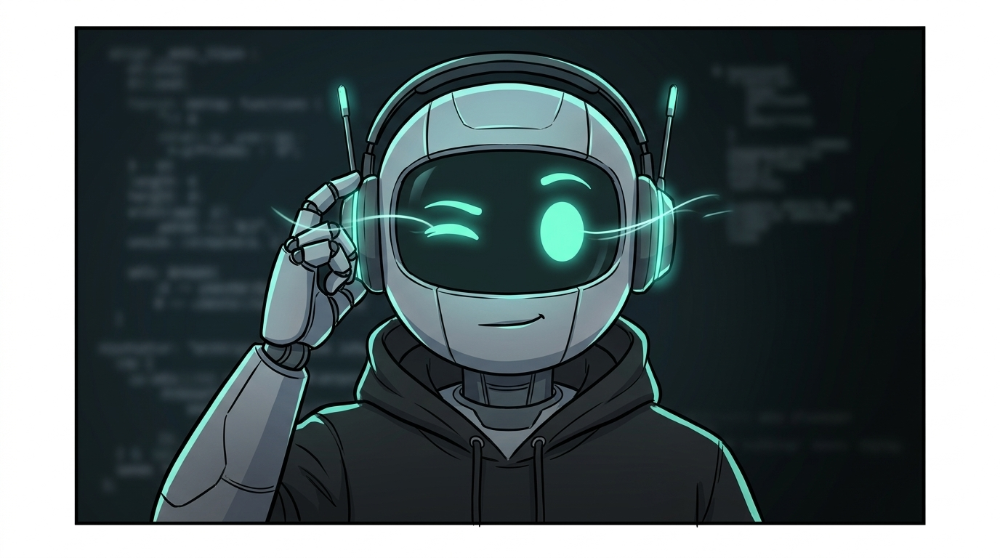

# STORYBOARD: PRESENTACIÓN EXPLOSIVA
**Reparto (Lore):** [cody]

## BLOQUE 1 (Escenas 1-6)

*LORE GLOSSARY:*
*[cody] = Semi-realistic 3D humanoid robot with metallic skin, wearing a black hoodie with "DECODER" printed on it, over-ear headphones. His eyes glow neon.*

*PROMPT:*
*A 6-panel comic-style storyboard layout (2 rows of 3 panels) showing the introduction of a character in different dynamic situations. Panel 1: [cody] from behind in a cyberpunk room, turning around rapidly with glowing green eyes. Through a window in the background, the silhouette of the "Cristo de la Concordia" statue is visible. Teal and orange cyberpunk lighting. Panel 2: [cody] medium shot facing the camera with a relaxed posture in his cyberpunk room. Shallow depth of field isolating him from neon signs in the background. Panel 3: [cody] in a fast tracking shot typing frantically in front of multiple glowing monitors. Strong yellow glowing eyes and bright rim light on his armor. Panel 4: [cody] outdoors during the day, riding and drifting a mountain bike on a dirt path in Parque Nacional Tunari. High motion blur, aggressive warm sunlight, with the valley city blurred in the background. Panel 5: Overhead shot of [cody] deploying a glowing blue sci-fi 3D topographic holographic map of Laguna Alalay with his hands. Interactive blue light reflecting on his face and armor. Panel 6: Close up of [cody]'s metallic face. The lighting is warm and orange resembling a sunset entering through the window. Highly detailed metallic texture. CRITICAL: Do not include any text, letters, subtitles, words, or speech bubbles anywhere in the image. The image must be completely free of typography.*

### Escena 1 (0:00 - 0:03) - [HOOK]
- **Thumbnail Narrativo:** Cody de espaldas en su cuarto cyberpunk. Por la ventana se perfila la silueta del Cristo de la Concordia. Volteando rápidamente. Ojos verdes.
- **Acción:** Se da la vuelta rápidamente y sus ojos cambian de azul a verde intenso.
- **Cámara y Fotografía:** Lente gran angular (14mm), ángulo contrapicado (low angle). Motion blur rápido, destello anamórfico (lens flare).
- **Iluminación / Color:** Claroscuro cyberpunk (Teal & Orange).
- **Audio / SFX:** Zumbido mecánico pesado + beat explosivo sintético.

### Escena 2 (0:03 - 0:08) - [PROMESA]
- **Thumbnail Narrativo:** Plano medio de Cody relajado frente a cámara en su cuarto.
- **Acción:** Habla directo a la cámara relajado, explicando quién es.
- **Cámara y Fotografía:** Plano medio. Shallow depth of field (f/1.8) para aislarlo de los monitores.
- **Iluminación / Color:** Continuación de Teal & Orange suave, iluminación amigable de frente.
- **Audio / SFX:** "Soy Cody. Programo, ando en bici y conozco cada esquina de Cochabamba."

### Escena 3 (0:08 - 0:12) - [MONTAJE 1]
- **Thumbnail Narrativo:** Tracking rápido de Cody programando con ojos amarillos.
- **Acción:** Teclea frenéticamente.
- **Cámara y Fotografía:** Tracking shot rápido hacia Cody. 
- **Iluminación / Color:** Fuerte Rim light (luz de contra) resaltando textura. Luz amarilla del monitor ilumina su rostro (Interactive Lighting).
- **Audio / SFX:** Música aumenta el ritmo, sintetizadores.

### Escena 4 (0:12 - 0:16) - [MONTAJE 2]
- **Thumbnail Narrativo:** Exterior día, Parque Nacional Tunari. Cody derrapando en MTB, valle urbano al fondo.
- **Acción:** Derrape agresivo en bicicleta de montaña en camino de tierra en el cerro.
- **Cámara y Fotografía:** Transición Glitch/Datamosh desde la anterior. Epic shot con Drone FPV o cámara en mano (shaky cam). Motion blur alto.
- **Iluminación / Color:** Iluminación cálida agresiva (luz de sol, contraste fuerte).
- **Audio / SFX:** Glitch digital + cadena de bici + derrape + sub-bass drop cinematográfico.

### Escena 5 (0:16 - 0:20) - [MONTAJE 3]
- **Thumbnail Narrativo:** Toma cenital de Cody activando un holograma azul topográfico destacando la Laguna Alalay.
- **Acción:** Despliega el holograma topográfico con ambas manos.
- **Cámara y Fotografía:** Plano cenital (overhead) con *Slow Push-in*.
- **Iluminación / Color:** Interactive Lighting: luz azul/cyan rebotando sobre la textura metálica desde abajo.
- **Audio / SFX:** Interfaz digital tech limpia.

### Escena 6 (0:20 - 0:28) - [GIRO]
- **Thumbnail Narrativo:** Close up del rostro de Cody, reflejos de luces cálidas de atardecer entrando por la ventana del Cristo.
- **Acción:** Hablando a la audiencia, reflexión sobre estereotipos.
- **Cámara y Fotografía:** Primer plano (Close up), lente de 50mm, f/1.8. 
- **Iluminación / Color:** Luces cambian a tonos cálidos/naranjas (Emulación Kodak Vision3 500T), simulando el sol atardeciendo.
- **Audio / SFX:** "La gente piensa que los robots somos aburridos... Es porque no conocen a Cochabamba."

---

## BLOQUE 2 (Escenas 7)

*LORE GLOSSARY:*
*[cody] = Semi-realistic 3D humanoid robot with metallic skin, wearing a black hoodie with "DECODER" printed on it, over-ear headphones. His eyes glow neon.*

*PROMPT:*
*A single-panel cinematic storyboard frame. Panel 1: [cody] adjusting his over-ear headphones and winking one eye. The background is transitioning to a dark screen with faint neon lights. CRITICAL: Do not include any text, letters, subtitles, words, or speech bubbles anywhere in the image. The image must be completely free of typography.*

### Escena 7 (0:28 - 0:35) - [CTA]
- **Thumbnail Narrativo:** Cody ajustando auriculares y guiñando un ojo. Fondo oscuro con neón sutil.
- **Acción:** Se despide y guiña un ojo.
- **Cámara y Fotografía:** Transición whip pan hacia esta pose, luego se va a negro.
- **Iluminación / Color:** Contraste fuerte con neones.
- **Audio / SFX:** "Sígueme si querés saber qué hace un robot los fines de semana en Bolivia." + Beat final.
