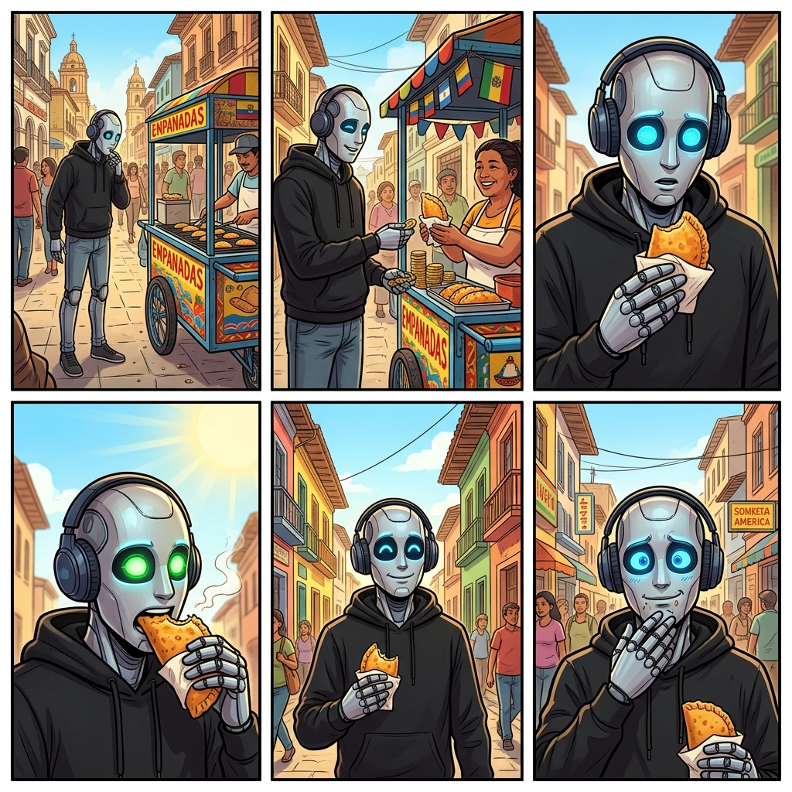

# STORYBOARD: UN ROBOT EN COCHABAMBA
**Versión:** 1
**Guion Base:** `script/final_script.md`

## Prompt Visual Global (Bloque Escenas 1-6)
*A 6-panel comic-style storyboard layout (2 rows of 3 panels). The main character is a semi-realistic humanoid robot with subtle metallic skin, wearing a plain black hoodie and over-ear headphones. Panel 1: The robot stands on a sunny sidewalk in a South American city, looking at a traditional street cart selling empanadas. Panel 2: The robot pays a local street vendor and receives an empanada. Panel 3: Close-up of the robot analyzing the empanada with confused, bright blue digital eyes. Panel 4: The robot takes a big bite, steam rises, and his digital eyes flash intensely green. Panel 5: The robot walks happily, chewing, with his digital eyes shaped in joyful arches. Panel 6: The robot looks directly at the viewer, wiping its chin, looking playfully nervous. Background for all panels: sunny, lively South American street. CRITICAL: Do not include any text, letters, subtitles, words, or speech bubbles anywhere in the image. The image must be completely free of typography.*

---

## Escena 1: Descubrimiento [0:00 - 0:05]
- **Thumbnail:** Cody frente al carrito de salteñas, ladeando la cabeza.
- **Narrativa / Acción:** Cody camina y de pronto se topa con el carrito humeante. Se detiene abruptamente y lo escanea.
- **Plano / Cámara:** Plano Medio. Cámara estática o muy ligero tilt up desde el carrito hacia Cody.
- **Audio / Transición:** SFX de escaneo robótico y campanita. Voz en off ("Mi primer día..."). Corte directo.

## Escena 2: La Compra [0:05 - 0:09]
- **Thumbnail:** Cody intercambiando monedas por la salteña con la vendedora.
- **Narrativa / Acción:** Compra rápida. Intercambio de la bolsita clásica y monedas.
- **Plano / Cámara:** Plano Medio Corto (Over the shoulder desde la casera).
- **Audio / Transición:** SFX de monedas y ruido de calle. Corte directo siguiendo el movimiento.

## Escena 3: Análisis [0:09 - 0:15]
- **Thumbnail:** Primer Plano de Cody sosteniendo la salteña frente a sus ojos (azules).
- **Narrativa / Acción:** Analizando lógicamente la imposibilidad física de que tenga jugo adentro sin desarmarse.
- **Plano / Cámara:** Primer Plano. Ángulo ligeramente contrapicado para enfatizar su confusión al mirarla.
- **Audio / Transición:** VO explicativo + SFX de Error de sistema. Corte directo rápido al morder.

## Escena 4: El Bocado [0:15 - 0:22]
- **Thumbnail:** Cody mordiendo la salteña. Humo saliendo. Ojos verdes.
- **Narrativa / Acción:** La gran mordida. Impacto de sabor. Pequeño cortocircuito sensorial por la maravilla de la salteña.
- **Plano / Cámara:** Plano Medio. Dolly in (acercamiento rápido) al momento exacto de la mordida.
- **Audio / Transición:** Crujido fuerte, sonido de "Level up", y VO "Error 404". Efecto visual ligero de "glitch". Corte directo.

## Escena 5: Felicidad [0:22 - 0:26]
- **Thumbnail:** Cody caminando feliz, ojos en forma de arco (^_^).
- **Narrativa / Acción:** Completamente conquistado por la gastronomía local, saboreando el jugo.
- **Plano / Cámara:** Plano Medio con cámara siguiendo a Cody (Tracking shot frontal).
- **Audio / Transición:** VO reflexionando sobre los sábados. Corte directo a la cuarta pared.

## Escena 6: CTA (Silpancho) [0:26 - 0:30]
- **Thumbnail:** Cody asustado/emocionado mirando a la cámara, limpiándose la barbilla.
- **Narrativa / Acción:** Rompe la cuarta pared. Habla directamente a la audiencia con un poco de jugo en la barbilla metálica.
- **Plano / Cámara:** Plano Pecho / Primer Plano cerrado.
- **Audio / Transición:** VO final de expectativa ("no estoy listo"). Cierre brusco al CTA gráfico de seguir.

---
