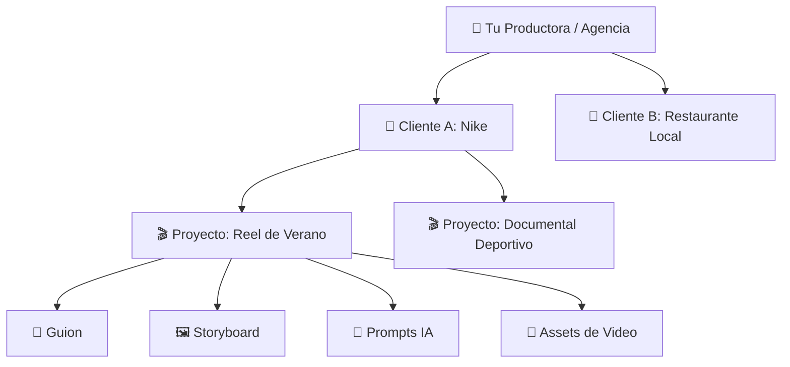
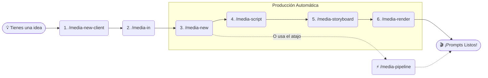

# 🧑‍🍳 Manual del Usuario: Media-Architect

¡Bienvenido a **media-architect**! Piensa en este framework como tu cocina profesional para producir videos con Inteligencia Artificial. Aquí tienes todas las herramientas, recetas (plantillas) y utensilios (comandos) necesarios para transformar una idea cruda en un platillo audiovisual gourmet.

---

## 🗺️ 1. Entendiendo la Arquitectura

Para mantener todo organizado, media-architect usa un sistema de "cajas dentro de cajas". Funciona exactamente como una productora del mundo real:

---

## 🚀 2. La Receta Maestra: El Flujo de Trabajo

El flujo de trabajo es lineal y está guiado por comandos fáciles de recordar. Aquí tienes el proceso paso a paso:

---

## 📖 3. El Menú de Comandos (Tus Utensilios)

| Comando | 🍳 ¿Para qué sirve? | ⏱️ Cuándo usarlo |
| :--- | :--- | :--- |
| **`/media-init`** | Prepara la cocina. Crea las carpetas por primera vez. | Sólo 1 vez al instalar el framework. |
| **`/media-new-client`** | Registra una nueva marca o cliente. | Cuando llega un cliente nuevo. |
| **`/media-in`** | Te pones el delantal y decides en qué vas a trabajar. | Antes de tocar cualquier guion. |
| **`/media-new`** | Crea el proyecto (Ej: Un Reel de 15 segundos). | Para iniciar un video nuevo. |
| **`/media-script`** | Empieza a escribir y corregir el guion. | Cuando el proyecto está vacío. |
| **`/media-storyboard`**| Transforma el guion en instrucciones de cámara. | Cuando el guion esté 100% aprobado. |
| **`/media-render`** | Trocea el video en escenas de 8-10s para la IA. | Cuando el storyboard esté listo. |
| **`/media-pipeline`** | **El botón mágico:** Hace script, storyboard y render seguidos. | Cuando tienes prisa y confías en la IA. |
| **`/media-assets`** | Guarda imágenes, videos y URLs descargados. | Para organizar archivos externos. |
| **`/media-status`** | Te da un reporte de cómo va tu video actual. | En cualquier momento del proceso. |
| **`/media-commit`** | Guarda el progreso (como un "Save Game"). | Frecuentemente. |

---

## 🎬 4. Ejemplo Práctico: Haciendo un TikTok Virál

Imagina que tu cliente se llama **EcoBici** y quieres hacer un TikTok sobre "Cómo evitar que te roben la bicicleta".

### Paso 1: Configurar el entorno
Escribe en el chat:
> *"Quiero usar `/media-new-client` para crear el cliente EcoBici."*

### Paso 2: Seleccionar el cliente
> *"Ejecuta `/media-in`. El cliente es EcoBici."*

### Paso 3: Crear el proyecto
> *"Usa `/media-new` para crear un video tipo 'short' llamado 'evitar-robos'."*

### Paso 4: Dejar que la magia ocurra (Atajo)
> *"Por favor, ejecuta el `/media-pipeline` para este video. El tema es '3 tips infalibles para que no roben tu bici', quiero un tono urbano, dinámico y que apunte a ciclistas de ciudad."*

El agente (Antigravity) se encargará de:
1. Escribir el guion (y preguntarte si te gusta).
2. Armar el storyboard con movimientos de cámara.
3. Generar los Prompts exactos en inglés (optimizados para Google Flow VEO) en la carpeta `prompts/video/`.

---

## 🧠 5. Consejos del Director (Best Practices)

1. **Itera el guion sin miedo:** No aceptes la primera versión si no te convence. Pídele al agente: *"Me gusta, pero hazlo más gracioso"* (esto modifica el `v1_script.md` a `v2_script.md`).
2. **Revisa las métricas:** El sistema calculará tu *Engagement Score*. Si es menor a 40/50, ¡pide que mejoren el Hook de los primeros 3 segundos!
3. **Todo en Inglés para la IA:** El sistema sabe que tú hablas español, pero los modelos de IA (Midjourney, VEO, Runway) entienden mejor el **inglés**. Por eso los prompts generados automáticamente por `/media-render` estarán en inglés técnico.
4. **Acota el contexto:** Si el agente se confunde, asegúrate de haber ejecutado `/media-in` para que el cerebro de la IA se enfoque sólo en el cliente activo.

---
*✨ ¡Estás listo para producir! Entra al chat y escribe `/media-new-client` para registrar a tu primer cliente.*
