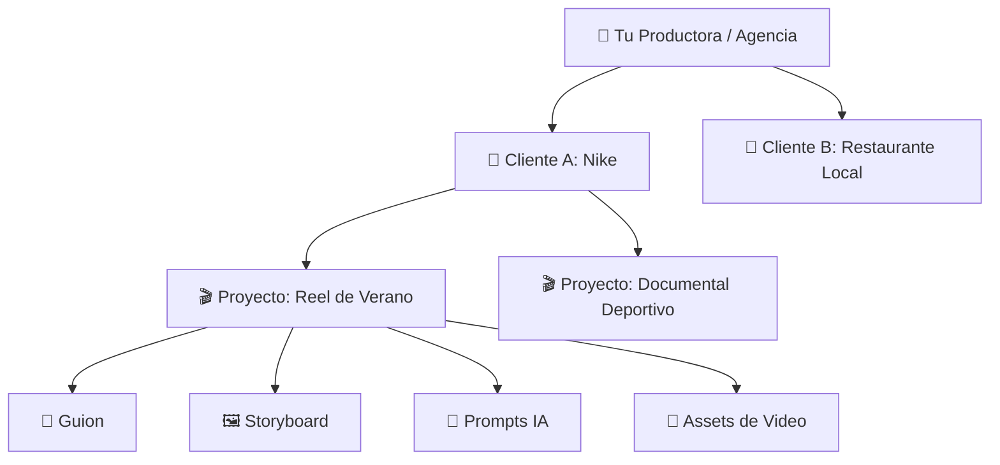
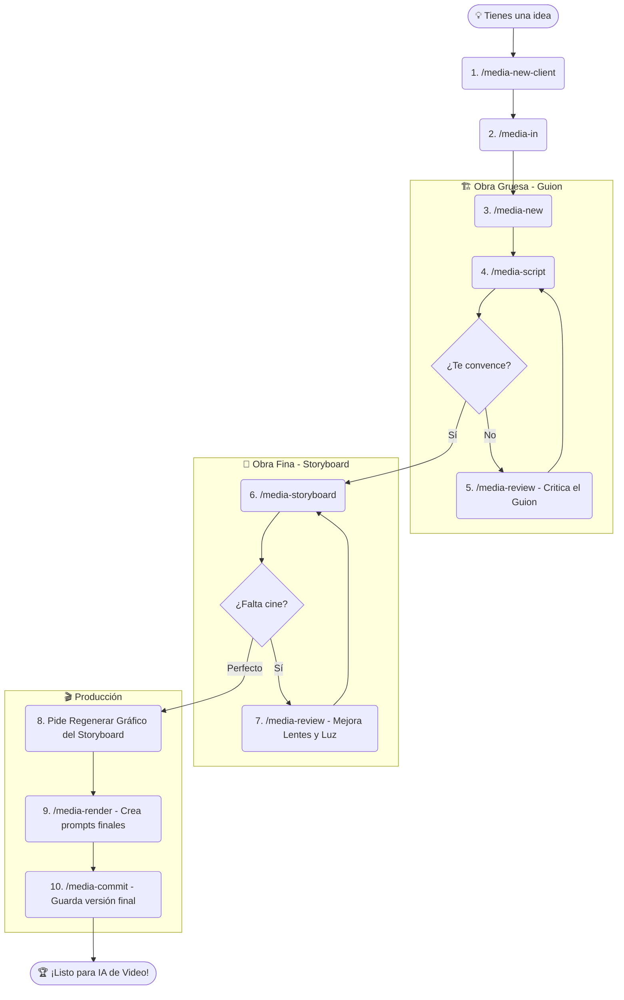

# 🧑‍🍳 Manual del Usuario: Media-Architect

¡Bienvenido a **media-architect**! Piensa en este framework como tu cocina profesional para producir videos con Inteligencia Artificial. Aquí tienes todas las herramientas, recetas (plantillas) y utensilios (comandos) necesarios para transformar una idea cruda en un platillo audiovisual gourmet.

---

## 🗺️ 1. Entendiendo la Arquitectura

Para mantener todo organizado, media-architect usa un sistema de "cajas dentro de cajas". Funciona exactamente como una productora del mundo real:

---

## 🚀 2. La Receta Maestra: El Flujo de Trabajo

El flujo de trabajo es lineal y está guiado por comandos fáciles de recordar. Aquí tienes el proceso paso a paso:

---

## 📖 3. El Menú de Comandos (Tus Utensilios)

| Comando | 🍳 ¿Para qué sirve? | ⏱️ Cuándo usarlo |
| :--- | :--- | :--- |
| **`/media-new-client`** | Registra una nueva marca o cliente. | Cuando llega un cliente nuevo. |
| **`/media-in`** | Te pones el delantal y decides en qué vas a trabajar. | Antes de tocar cualquier proyecto. |
| **`/media-new`** | Crea un proyecto (Ej: Reel de 15s). | Para iniciar un video nuevo. |
| **`/media-script`** | Crea tu "obra gruesa" (`script.md`). | Para arrancar la estructura del video. |
| **`/media-storyboard`**| Tu "obra fina" (`storyboard.md`). Añade lentes y luces. | Cuando el guion esté 100% aprobado. |
| **`/media-review`** | **El Experto:** Llama al Director Creativo para criticar y mejorar tu guion o tu storyboard. | En cualquier momento para subir el nivel del proyecto. |
| **`/media-character`**| **Casting & Props:** Registra un Actor o un Objeto para mantener consistencia visual en todos los videos. | Cuando un personaje u objeto aparece en múltiples proyectos. |
| **`/media-render`** | Traduce el storyboard en Prompts de Video en inglés. | Cuando la cinematografía esté lista. |
| **`/media-commit`** | **Guardar (Save Game):** Congela la versión en Git. | Cuando terminas una etapa importante. |
| **`/media-status`** | Te da un reporte de cómo va tu video actual. | En cualquier momento del proceso. |

---

## 🎬 4. La Receta Paso a Paso (Tutorial)

Imagina que tu cliente se llama **EcoBici** y quieres hacer un TikTok sobre "Cómo evitar que te roben la bicicleta". Sigue estos pasos exactos:

### Fase 1: Preparación (Mise en place)
1. **Crear Cliente:** Escribe en el chat: *"Ejecuta `/media-new-client` para crear EcoBici."*
2. **Entrar a la Cocina:** Escribe: *"Ejecuta `/media-in` y selecciona EcoBici."*
3. **Crear Proyecto:** Escribe: *"Ejecuta `/media-new` para crear un video tipo 'short' llamado 'evitar-robos'."*

### Fase 2: Obra Gruesa (El Guion)
4. **Escribir Base:** Escribe: *"Ejecuta `/media-script`. El tema es '3 tips infalibles para que no roben tu bici', tono urbano."* (Esto crea tu archivo único `script.md`).
5. **Criticar y Mejorar:** ¿Sientes que el guion es aburrido? Escribe: *"Ejecuta `/media-review` sobre el guion"*. El Agente analizará la psicología, mejorará los ganchos (hooks) y sobrescribirá el archivo haciéndolo más viral.
6. **Guardar Progreso:** Escribe *"Ejecuta `/media-commit` para guardar mi guion final"*.

### Fase 3: Obra Fina (El Storyboard y Fotografía)
7. **Diseño Visual:** Escribe *"Ejecuta `/media-storyboard`"*. El Agente traducirá tu texto a planos de cámara y te dejará un `storyboard.md`.
8. **Revisión de Hollywood:** Escribe *"Ejecuta `/media-review` sobre el storyboard"*. Aquí, el experto cambiará tu cámara aburrida por *"Lentes de 35mm, Dolly In y luz Golden Hour"*. Acepta sus sugerencias.
9. **Ver el Gráfico:** Como el texto cambió, dile al Agente: *"Por favor, regenera la imagen del gráfico del storyboard basándote en el nuevo prompt en inglés"*. ¡Verás un cómic perfecto de tu idea!

### Fase 4: Horneado Final (Prompts de Video)
10. **Render:** Escribe *"Ejecuta `/media-render`"*. El Agente aislará cada escena y creará archivos individuales hiper-profesionales en inglés (listos para copiar y pegar en Sora, VEO o Runway).
11. **Guardar Final:** Cierra con broche de oro escribiendo *"Ejecuta `/media-commit`"*.

---

## 🧠 5. Consejos del Productor (Best Practices)

1. **Un solo archivo (Zero Basura):** El sistema solo usa `script.md` y `storyboard.md`. No guardes versiones como `v1`, `v2`. Usa `/media-commit` para que Git guarde la historia. Si un cliente pide un cambio 3 meses después, simplemente modifica el archivo y haz otro commit.
2. **Apóyate en el Experto (`/media-review`):** No confíes en tu primer borrador. Siempre pásalo por el escrutinio del experto. Él sabe más de lentes y retención de audiencia que nosotros.
3. **Todo en Inglés para la IA:** El sistema sabe que tú hablas español, pero los modelos de IA entienden mejor el **inglés**. Por eso los prompts generados por `/media-render` estarán en inglés técnico.

---

## 💬 6. Ejemplos de Conversación con la IA

Para sacarle el mayor provecho al Agente, háblale como si fuera tu empleado o tu compañero de agencia. Aquí tienes ejemplos de qué decirle en el chat:

**Para iniciar algo rápido:**
> *"Usa `/media-pipeline` para hacer un TikTok de 30 segundos sobre zapatillas deportivas. Que el tono sea muy energético y el público objetivo sean adolescentes."*

**Para iterar el guion (Obra Gruesa):**
> *"Acabo de leer el guion. Me gusta la estructura, pero quiero que el personaje principal sea más sarcástico. Modifica el `script.md` manteniendo la misma duración."*

**Para usar al Experto:**
> *"Tengo dudas sobre este storyboard. Corre un `/media-review` y fíjate si la iluminación tiene sentido para una película de terror."*

**Para corregir gráficos:**
> *"El texto del `storyboard.md` está perfecto, pero el gráfico generado salió mal. Regenera el gráfico del storyboard usando el prompt en inglés que escribiste."*

**Para guardar cambios:**
> *"Haz un `/media-commit` con el mensaje 'Guion final aprobado por el cliente'."*

---

## 💡 7. Tips y Trucos Avanzados

A veces el proceso creativo no es una línea recta. Aquí tienes algunos trucos para dominar el framework como un profesional:

**1. "Quiero volver atrás (Retroceder de Storyboard a Guion)"**
Si ya estás viendo el storyboard y de repente te das cuenta de que la historia no tiene sentido, ¡no entres en pánico! Puedes retroceder sin problemas:
* Escribe: *"Ignora el storyboard por ahora. Quiero hacer un `/media-review` de mi `script.md` porque el final es aburrido"*.
* Una vez que el Agente mejore tu guion y te guste, simplemente dile: *"Perfecto, ahora vuelve a ejecutar `/media-storyboard` con este nuevo guion"*. El Agente sobrescribirá la "obra fina" para que coincida con tu nueva historia.

**2. "El texto del Storyboard está perfecto, pero la imagen es fea"**
Las IAs de imágenes a veces se equivocan (ej. dibujan 7 paneles en lugar de 6). Como el texto Markdown es lo que realmente importa, no tienes que regenerar todo el storyboard.
* Simplemente dile al Agente en el chat: *"Regenera la imagen del storyboard basándote en el prompt visual global, la anterior salió mal"*. El Agente generará un nuevo `.jpg` sin alterar tus valiosos textos técnicos.

**3. Sé específico con tu experto**
Cuando uses `/media-review`, puedes darle directrices al experto. En lugar de solo lanzar el comando, acompáñalo con contexto: *"Ejecuta `/media-review` sobre el storyboard, pero enfócate estrictamente en hacer que la iluminación se vea como una película de Batman"*.

**4. Crea tu "Show Bible" (Lore Centralizado)**
Si tu cliente tiene personajes recurrentes (ej. un robot llamado Cody) o props icónicos (ej. un empaque de producto específico, una salteña), no dejes que la IA los invente cada vez. 
* Usa el comando `/media-character` para registrar la entidad (Actor o Prop). 
* El Agente te pedirá los detalles y guardará un prompt visual maestro que el sistema utilizará de forma automática en todos los futuros guiones y storyboards de ese cliente para garantizar consistencia visual y narrativa absoluta.

---
*✨ ¡Estás listo para producir! Entra al chat y escribe `/media-new-client` para registrar a tu primer cliente.*
