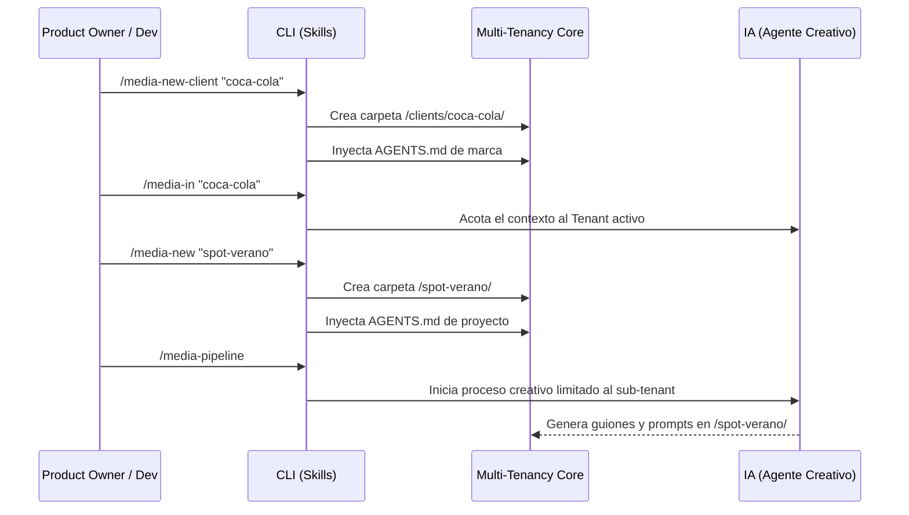

# 🏢 Multi-Tenancy Core: Arquitectura y Funcionamiento

¡Bienvenido al núcleo de **media-architect**! Esta guía didáctica está diseñada para Product Owners (POs) y Desarrolladores (Devs) para que entiendan a fondo cómo gestionamos múltiples marcas y proyectos audiovisuales sin perder el control ni sobrecargar a nuestros agentes de IA.

---

## 🧠 1. ¿Qué es el Multi-Tenancy en media-architect?

Imagina un gran edificio de oficinas (el **Framework**). En lugar de que todos trabajen revueltos en una gran sala, le asignamos a cada empresa (**Cliente**) su propio piso. A su vez, dentro de ese piso, cada equipo de grabación tiene su propia oficina cerrada (**Proyecto de Video**).

En términos técnicos, el "Multi-Tenancy" (Multitenencia) es la capacidad de nuestra arquitectura para aislar entornos, contextos y datos de diferentes clientes y proyectos, permitiendo escalar a cientos de marcas sin fricción.

### 🎯 Beneficios Principales
1. **Aislamiento de Contexto (Token Saving):** Evita que la IA "mezcle" la identidad visual de Coca-Cola con la de Nike. 
2. **Modularidad:** Si algo falla en un proyecto, no afecta al resto del sistema.
3. **Escalabilidad:** Permite crecer infinitamente agregando más clientes sin reestructurar el framework.

---

## 🗺️ 2. Estructura de Directorios

Así es como se ve el edificio por dentro. Todo ocurre dentro de la carpeta `clients/`:

```text
media-architect/
└── clients/
    ├── coca-cola/                    <-- 🏢 NIVEL 1: TENANT (Cliente)
    │   ├── AGENTS.md                 <-- 🧠 Contexto de la marca (Tono, manual de marca)
    │   ├── README.md                 <-- 📄 Resumen del cliente
    │   │
    │   ├── spot-verano-2024/         <-- 🎬 NIVEL 2: SUB-TENANT (Proyecto)
    │   │   ├── AGENTS.md             <-- 🧠 Contexto Específico (Idea del spot)
    │   │   ├── manifest.yaml         <-- ⚙️ Metadata de producción
    │   │   ├── config/               <-- 🔧 Config de IAs (VEO, Midjourney, etc.)
    │   │   ├── scene_001.md          <-- 🎞️ Escenas generadas
    │   │   └── prompts/              <-- 💬 Prompts listos
    │   │
    │   └── reels-tiktok/             <-- 🎬 NIVEL 2: Otro Proyecto
    │
    └── nike/                         <-- 🏢 OTRO TENANT (Cliente)
```

---

## 🔄 3. El Flujo de Trabajo (Process Flow)

¿Cómo es el ciclo de vida de un proyecto desde el punto de vista del Multi-Tenancy? Aquí tienes el diagrama completo:



### Explicación Paso a Paso:
1. **Onboarding del Cliente:** Se usa `/media-new-client` para crear el *Tenant* raíz.
2. **Fijar el Contexto:** El comando vital es **`/media-in`**. Actúa como una "llave" que encierra a la IA dentro de esa habitación específica, ignorando el resto del edificio.
3. **Creación del Proyecto:** `/media-new` inicializa el *Sub-tenant* con sus propias reglas y dependencias.
4. **Ejecución:** `/media-pipeline` hace su magia, pero el agente solo lee el `AGENTS.md` local y global, manteniendo todo ultraligero y preciso.

---

## 🧩 4. Archivos Clave del Core (Troubleshooting)

Si eres un Dev y necesitas arreglar un bug o implementar una nueva feature, aquí es donde debes mirar:

| Archivo/Módulo | Ubicación | Función Principal | ¿Qué pasa si falla? |
| :--- | :--- | :--- | :--- |
| **Plantillas Base** | `templates/` | Define qué archivos se copian al crear un nuevo cliente o proyecto. | Los nuevos proyectos se crearán vacíos o incompletos. |
| **Script `/media-in`** | `.agents/skills/media-in/SKILL.md` | Define el estado activo del usuario acotando la IA. | La IA alucinará contextos de otros clientes o gastará tokens extra. |
| **`AGENTS.md` (Global)** | `/AGENTS.md` (Raíz) | Instrucciones base para que la IA actúe como un estudio de cine. | La IA olvidará que es directora de cine o guionista. |
| **`AGENTS.md` (Local)** | `clients/[cliente]/AGENTS.md` | Contexto local. Se concatena dinámicamente gracias al core del agente. | Fallos en el tono de voz de la marca o formato. |

---

## 🛠️ 5. Guía para Extender el Core (Nuevas Features)

Si el PO pide una nueva funcionalidad (Ej. "Quiero que cada cliente tenga un gestor de facturación"):

1. **Modifica los Templates:** Ve a `templates/client/` y añade la estructura que necesitas (ej. carpeta `billing/`).
2. **Crea un nuevo Skill:** Ve a `.agents/skills/` y crea `/media-billing` para gestionar esa lógica.
3. **Acota el Scope:** Asegúrate de que el nuevo skill **siempre** verifique en qué cliente estamos (normalmente leyendo el path activo o variables de entorno seteadas por `/media-in`).

> 💡 **Tip de Arquitectura:** En la **Fase 2** del roadmap, integraremos el *Model Context Protocol (MCP)*. El Multi-Tenancy Core está diseñado para que cada cliente pueda tener su propio servidor MCP aislado, consultando sus bases de datos específicas de assets.
