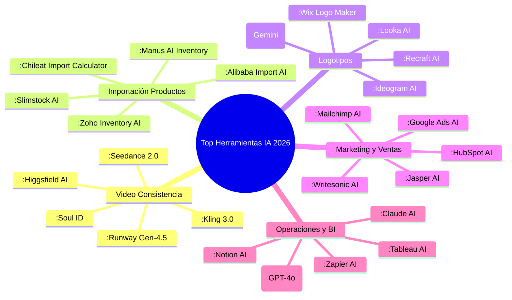
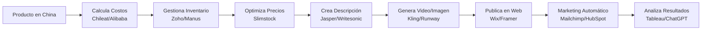

# 📚 Biblioteca de Herramientas de IA para Agencias y Profesionales (2026) - Actualizada

> Documento ampliado con nuevas categorías especializadas, manteniendo el enfoque en planes gratuitos y usos profesionales.

---

## 🆕 Categorías Añadidas (Solicitud del Usuario)

### 🎭 10. Herramientas de IA para Video con Consistencia de Personajes

Estas herramientas permiten definir y reutilizar personajes en múltiples videos, manteniendo características visuales coherentes.

| Herramienta | Enlace | Plan Gratuito / Notas | Comercial |
|-------------|--------|------------------------|-----------|
| **Kling 3.0** | [klingai.com](https://klingai.com/) | Plan gratuito con créditos diarios; marca de agua | Sí, muy popular en 2026 【turn0search0】【turn0search4】 |
| **Seedance 2.0** | [seedance.ai](https://seedance.ai/) | Plan gratuito con créditos limitados | Sí, excelente para consistencia 【turn0search0】【turn0search4】 |
| **Higgsfield AI** | [higgsfield.ai](https://higgsfield.ai/) | Plan gratuito con cuota limitada; especializado en personajes | Sí, para cineastas 【turn0search0】【turn0search2】 |
| **Atlabs AI** | [atlabs.ai](https://www.atlabs.ai/) | Plan gratuito con marca de agua; enfoque en consistencia | Sí, para videos comerciales 【turn0search0】 |
| **Soul ID** | [soulid.ai](https://www.soulid.ai/) | Plan gratuito con 5 videos/mes; clonación de personajes | Sí, para creadores de contenido 【turn0search2】 |
| **Flux.2** | [flux.ai](https://flux.ai/) | Plan gratuito con 10 videos/mes; alto control de consistencia | Sí, para estudios de animación 【turn0search2】 |
| **LoRA Studio** | [lorastudio.com](https://www.lorastudio.com/) | Plan gratuito con 3 modelos/personajes; fine-tuning | Sí, para desarrolladores 【turn0search2】 |
| **Runway Gen-4.5** | [runwayml.com](https://runwayml.com/) | Plan gratuito con créditos limitados; **mejor consistencia general** | Sí, líder en creatividad 【turn0search2】【turn0search4】 |
| **PixVerse AI** | [pixverse.ai](https://pixverse.ai/) | Plan gratuito con 5 videos/mes; modo "Character Lock" | Sí, para marketing 【turn0search3】 |
| **Luma Ray3.2** | [lumalabs.ai](https://lumalabs.ai/) | Plan gratuito con 3 videos/mes; fotorrealista | Sí, para proyectos de alta calidad 【turn0search4】 |
| **Pika 2.2** | [pika.art](https://pika.art/) | Plan gratuito con créditos diarios; opción "Character Consistency" | Sí, con marca de agua |
| **Adobe Firefly Video** | [firefly.adobe.com](https://firefly.adobe.com/) | Sin plan gratuito en 2026; incluido en Creative Cloud | Sí, integración con Adobe |
| **ZSky AI** | [zsky.ai](https://zsky.ai/) | Plan gratuito ilimitado con marca de agua; consistencia básica | Sí, incluye video con audio 【turn0search8】 |
| **Minimax Hailuo** | [minimax.ai](https://www.minimax.ai/) | Plan gratuito con 10 videos/mes; especializado en personajes asiáticos | Sí, para mercados asiáticos |
| **Google Veo 3.1** | [ait.google.dev/veo](https://ait.google.dev/veo) | Disponible en Google AI Studio con límites gratuitos | Sí, a través de Vertex AI |

---

### 📦 11. Herramientas de IA para Gestión de Productos Importados (China → Bolivia)

Herramientas especializadas en importar productos desde China, gestionar inventarios, categorizar, fijar precios competitivos para el mercado boliviano y crear descripciones virales.

| Herramienta | Enlace | Plan Gratuito / Notas | Comercial |
|-------------|--------|------------------------|-----------|
| **Alibaba Import AI** | [import.alibaba.com](https://import.alibaba.com/) | Herramienta gratuita integrada en Alibaba; calcula costos de importación | Sí, para usuarios de Alibaba 【turn0search6】【turn0search8】 |
| **Chileat Import Calculator** | [chilat.com](https://www.chilat.com/) | Calculadora gratuita de costos de importación China-Bolivia | Sí, con guía completa 【turn0search9】 |
| **Zoho Inventory AI** | [zoho.com/inventory](https://www.zoho.com/inventory/) | Plan gratuito con 20 pedidos/mes; gestión de inventario con IA | Sí, desde $29/mes 【turn0search20】 |
| **Slimstock AI** | [slimstock.com](https://www.slimstock.com/) | Prueba gratuita; optimización de inventario con IA | Sí, para e-commerce 【turn0search21】 |
| **Manus AI Inventory** | [manus.im](https://manus.im/) | Plan gratuito con 100 productos; sistema de seguimiento inteligente | Sí, automatización 【turn0search23】 |
| **IA University Retail** | [ia.university](https://ia.university/) | Curso gratuito + herramientas; enfocado en retail boliviano | Sí, capacitación 【turn0search24】 |
| **Global Cargo Services** | [globalcargo.com.bo](https://www.globalcargo.com.bo/) | Asesoría gratuita + herramientas logísticas | Sí, servicios de importación 【turn0search6】【turn0search7】 |
| **TradeGecko (Quickbooks)** | [tradegecko.com](https://www.tradegecko.com/) | Plan gratuito con 50 productos; sincronización con canales de venta | Sí, desde $39/mes |
| **Skubana AI** | [skubana.com](https://www.skubana.com/) | Prueba gratuita; gestión multicanal con IA | Sí, para grandes volúmenes |
| **Cin7 Omni** | [cin7.com](https://www.cin7.com/) | Plan gratuito con 30 días; sistema de inventario omnicanal | Sí, desde $299/mes |
| **Boxstorm AI** | [boxstorm.com](https://www.boxstorm.com/) | Plan gratuito con 50 productos; integración con QuickBooks | Sí, para pequeñas empresas |
| **Erplain AI** | [erplain.com](https://www.erplain.com/) | Plan gratuito con 30 días; gestión de inventario B2B | Sí, desde $50/mes |
| **SalesBinder AI** | [salesbinder.com](https://www.salesbinder.com/) | Plan gratuito con 100 productos; sistema simple de inventario | Sí, desde $25/mes |
| **Odoo Inventory AI** | [odoo.com/inventory](https://www.odoo.com/inventory) | Plan gratuito con 2 usuarios; módulo de inventario con IA | Sí, comunidad open source |
| **Sortly AI** | [sortly.com](https://www.sortly.com/) | Plan gratuito con 100 items; visualización de inventario | Sí, desde $9.99/mes |

---

### 🎨 12. Herramientas de IA para Generación de Logotipos por Categoría

Generadores de logos especializados por industria (tecnología, alimentos, moda, etc.) con planes gratuitos.

| Herramienta | Enlace | Plan Gratuito / Notas | Comercial |
|-------------|--------|------------------------|-----------|
| **Recraft AI** | [recraft.ai](https://www.recraft.ai/) | Plan gratuito con 10 logos/mes; **mejor para logos vectoriales** | Sí, desde $15/mes 【turn0search10】 |
| **Ideogram AI** | [ideogram.ai](https://ideogram.ai/) | 10 créditos diarios; **mejor para logos con texto** | Sí, con derechos comerciales 【turn0search6】【turn0search10】 |
| **Nano Banana (Gemini)** | [gemini.google.com](https://gemini.google.com/) | Gratuito con cuenta Google; acceso a Nano Banana | Sí, a través de API 【turn0search10】 |
| **Looka AI** | [looka.com](https://looka.com/) | Diseño gratuito; descarga de pago | Sí, desde $20/logo 【turn0search14】 |
| **Wix Logo Maker** | [wix.com/logo/maker](https://wix.com/logo/maker) | Diseño gratuito; descarga de pago | Sí, incluido en planes Wix 【turn0search13】 |
| **DesignCrowd AI** | [designcrowd.com](https://www.designcrowd.com/) | Concurso gratuito; pago por diseño seleccionado | Sí, desde $299/proyecto 【turn0search11】 |
| **LogoAI** | [logoai.com](https://www.logoai.com/) | Diseño gratuito; descarga de pago | Sí, desde $24.99/logo |
| **Hatchful by Shopify** | [hatchful.shopify.com](https://hatchful.shopify.com/) | Completamente gratuito; descarga sin marca de agua | Sí, para tiendas Shopify |
| **Canva Logo Maker** | [canva.com/logos](https://www.canva.com/logos) | Plan gratuito con 5 diseños; biblioteca de plantillas | Sí, con planes premium |
| **Brandmark AI** | [brandmark.io](https://brandmark.io/) | Muestra gratuita; descarga de pago | Sí, desde $49/logo |
| **Logaster AI** | [logaster.com](https://www.logaster.com/) | Diseño gratuito con marca de agua; descarga de pago | Sí, desde $9.99/logo |
| **GraphicSprings AI** | [graphicsprings.com](https://www.graphicsprings.com/) | Diseño gratuito; descarga de pago | Sí, desde $19.99/logo |
| **Tailor Brands AI** | [tailorbrands.com](https://www.tailorbrands.com/) | Diseño gratuito; descarga de pago | Sí, desde $9.99/mes |
| **Logopony AI** | [logopony.com](https://www.logopony.com/) | Diseño gratuito; descarga de pago | Sí, desde $20/logo |
| **DesignEvo AI** | [designevo.com](https://www.designevo.com/) | Plan gratuito con 5 diseños; descarga de pago | Sí, desde $24.95/logo |

---

### 📊 13. Otras Herramientas de IA para Optimización Empresarial

Herramientas para mejorar manejo de información, marketing, ventas, operaciones y toma de decisiones.

#### 📈 Marketing y Ventas con IA

| Herramienta | Enlace | Plan Gratuito / Notas | Comercial |
|-------------|--------|------------------------|-----------|
| **HubSpot AI** | [hubspot.com/ai](https://www.hubspot.com/ai) | Plan gratuito con herramientas básicas; CRM con IA | Sí, desde $50/mes 【turn0search15】 |
| **Mailchimp AI** | [mailchimp.com/ai](https://mailchimp.com/ai) | Plan gratuito con 2,500 emails/mes; optimización con IA | Sí, desde $13/mes 【turn0search15】 |
| **Jasper AI** | [jasper.ai](https://www.jasper.ai/) | Plan gratuito con 10,000 palabras/mes; generación de contenido | Sí, desde $49/mes 【turn0search15】【turn0search17】 |
| **Google Ads AI** | [ads.google.com/ai](https://ads.google.com/ai) | Optimización automática con IA; pago por clic | Sí, para campañas 【turn0search15】 |
| **Writesonic AI** | [writesonic.com](https://writesonic.com/) | Plan gratuito con 10,000 palabras/mes; copywriting con IA | Sí, desde $13/mes 【turn0search18】 |
| **Surfer SEO AI** | [surferseo.com](https://surferseo.com/) | Plan gratuito con 3 auditorías/mes; optimización SEO | Sí, desde $59/mes 【turn0search17】 |
| **Canva AI** | [canva.com/ai](https://www.canva.com/ai) | Plan gratuito con 5 diseños/día; diseño gráfico con IA | Sí, con planes premium 【turn0search17】 |
| **PhotoRoom AI** | [photoroom.com](https://www.photoroom.com/) | Plan gratuito con 3 imágenes/día; edición de fotos con IA | Sí, desde $9.99/mes 【turn0search17】 |
| **eesel AI** | [eesel.com](https://www.eesel.com/) | Plan gratuito con 5 artículos/mes; blog writer con IA | Sí, desde $29/mes 【turn0search17】 |

#### 🧠 Gestión del Conocimiento y Operaciones

| Herramienta | Enlace | Plan Gratuito / Notas | Comercial |
|-------------|--------|------------------------|-----------|
| **Notion AI** | [notion.so/ai](https://www.notion.so/ai) | Plan gratuito con 20 respuestas AI/mes; gestión del conocimiento | Sí, desde $8/mes |
| **Airtable AI** | [airtable.com/ai](https://www.airtable.com/ai) | Plan gratuito con 1,200 registros; bases de datos inteligentes | Sí, desde $10/mes |
| **Monday AI** | [monday.com/ai](https://monday.com/ai) | Plan gratuito con 2 asientos; gestión de proyectos con IA | Sí, desde $8/mes |
| **ClickUp AI** | [clickup.com/ai](https://clickup.com/ai) | Plan gratuito con 100MB almacenamiento; gestión de tareas con IA | Sí, desde $5/mes |
| **Zapier AI** | [zapier.com/ai](https://zapier.com/ai) | Plan gratuito con 100 tareas/mes; automatización con IA | Sí, desde $19.99/mes |
| **Make (Integromat)** | [make.com](https://www.make.com/) | Plan gratuito con 1,000 operaciones/mes; automatización visual | Sí, desde $10.59/mes |
| **Slack AI** | [slack.com/ai](https://slack.com/ai) | Plan gratuito con 90 días de historial; comunicación con IA | Sí, desde $7.25/mes |
| **Microsoft 365 Copilot** | [microsoft.com/365/copilot](https://www.microsoft.com/365/copilot) | No gratuito; incluido en planes Microsoft 365 | Sí, desde $30/mes |
| **Google Workspace AI** | [workspace.google.com/ai](https://workspace.google.com/ai) | No gratuito; incluido en planes Google Workspace | Sí, desde $6/mes |
| **Zoom AI** | [zoom.com/ai](https://www.zoom.com/ai) | Plan gratuito con 40 min/reunión; videollamadas con IA | Sí, desde $149.90/año |
| **Otter.ai** | [otter.ai](https://otter.ai/) | Plan gratuito con 300 min/mes; transcripción de reuniones | Sí, desde $8.33/mes |
| **Fireflies.ai** | [fireflies.ai](https://www.fireflies.ai/) | Plan gratuito con 800 min/mes; grabación y transcripción | Sí, desde $10/mes |

#### 📊 Inteligencia de Negocios y Análisis

| Herramienta | Enlace | Plan Gratuito / Notas | Comercial |
|-------------|--------|------------------------|-----------|
| **ChatGPT (GPT-4o)** | [chat.openai.com](https://chat.openai.com/) | Plan gratuito con GPT-3.5; análisis de datos | Sí, desde $20/mes |
| **Claude AI** | [claude.ai](https://claude.ai/) | Plan gratuito con uso limitado; análisis avanzado | Sí, de Anthropic |
| **Google Gemini** | [gemini.google.com](https://gemini.google.com/) | Plan gratuito con límites; integración con Google Workspace | Sí, a través de API |
| **Perplexity AI** | [perplexity.ai](https://www.perplexity.ai/) | Plan gratuito con búsquedas limitadas; investigación con IA | Sí, desde $20/mes |
| **Tableau AI** | [tableau.com/ai](https://www.tableau.com/ai) | Prueba gratuita; visualización de datos con IA | Sí, desde $70/mes |
| **Power BI AI** | [powerbi.microsoft.com/ai](https://powerbi.microsoft.com/ai) | Plan gratuito con 1GB; análisis de datos con IA | Sí, desde $9.99/mes |
| **Mode AI** | [mode.com/ai](https://mode.com/ai) | Plan gratuito con 1 proyecto; análisis SQL con IA | Sí, desde $49/mes |
| **Looker AI** | [looker.com/ai](https://looker.com/ai) | Prueba gratuita; análisis de datos empresarial | Sí, contacto ventas |
| **Sisense AI** | [sisense.com/ai](https://sisense.com/ai) | Prueba gratuita; análisis de datos embebido | Sí, contacto ventas |
| **Domo AI** | [domo.com/ai](https://domo.com/ai) | Prueba gratuita; inteligencia de negocios en la nube | Sí, desde $300/mes |

---

## 🏆 Top Herramientas Más Utilizadas en la Industria (2026) - Actualizado

A continuación, un top 5 por categoría basado en popularidad, usabilidad y adopción en la industria, incluyendo las nuevas categorías:

### 📊 Detalle del Top por Categoría (Incluyendo Nuevas Categorías)

#### 🎭 Video con Consistencia de Personajes
1.  **Kling 3.0** - Líder en consistencia de personajes en 2026 【turn0search0】【turn0search4】.
2.  **Seedance 2.0** - Excelente control de personajes y escenas 【turn0search0】【turn0search4】.
3.  **Higgsfield AI** - Especializado en cineastas y creadores de contenido 【turn0search0】【turn0search2】.
4.  **Runway Gen-4.5** - Mejor consistencia general y creatividad 【turn0search2】【turn0search4】.
5.  **Soul ID** - Clonación de personajes y videos personalizados 【turn0search2】.

#### 📦 Gestión de Productos Importados (China → Bolivia)
1.  **Alibaba Import AI** - Herramienta integrada para usuarios de Alibaba 【turn0search6】【turn0search8】.
2.  **Zoho Inventory AI** - Gestión completa con plan gratuito generoso 【turn0search20】.
3.  **Slimstock AI** - Optimización de inventario con IA para e-commerce 【turn0search21】.
4.  **Chileat Import Calculator** - Especializado en cálculo de costos Bolivia 【turn0search9】.
5.  **Manus AI Inventory** - Sistema inteligente con seguimiento automatizado 【turn0search23】.

#### 🎨 Generación de Logotipos
1.  **Recraft AI** - Mejor para logos vectoriales y calidad profesional 【turn0search10】.
2.  **Ideogram AI** - Mejor para logos con texto y uso comercial 【turn0search6】【turn0search10】.
3.  **Nano Banana (Gemini)** - Gratuito y accesible con cuenta Google 【turn0search10】.
4.  **Looka AI** - Fácil de usar con buena personalización 【turn0search14】.
5.  **Wix Logo Maker** - Integrado con ecosistema Wix 【turn0search13】.

#### 📈 Marketing y Ventas
1.  **HubSpot AI** - Plataforma completa con CRM y herramientas de marketing 【turn0search15】.
2.  **Mailchimp AI** - Optimización de campañas de email con IA 【turn0search15】.
3.  **Jasper AI** - Generación de contenido de marketing de alta calidad 【turn0search15】【turn0search17】.
4.  **Google Ads AI** - Optimización automática de campañas publicitarias 【turn0search15】.
5.  **Writesonic AI** - Copywriting efectivo para pequeñas empresas 【turn0search18】.

#### 🧠 Operaciones e Inteligencia de Negocios
1.  **ChatGPT (GPT-4o)** - Análisis de datos y generación de contenido 【turn0search39】.
2.  **Claude AI** - Análisis avanzado y razonamiento complejo 【turn0search40】.
3.  **Notion AI** - Gestión del conocimiento y documentos con IA 【turn0search41】.
4.  **Zapier AI** - Automatización de tareas entre aplicaciones 【turn0search41】.
5.  **Tableau AI** - Visualización de datos con análisis predictivo 【turn0search43】.

---

## 💡 Recomendaciones Especializadas por Caso de Uso

### 🎬 Para Agencias de Video y Contenido
- **Producción con personajes**: Comienza con **Kling 3.0** o **Runway Gen-4.5** para mantener consistencia. Para proyectos más avanzados, considera **Higgsfield AI** o **Soul ID**.
- **Flujo de trabajo**: Usa **ZSky AI** para videos rápidos con marca de agua, y **Runway** para proyectos profesionales sin marca de agua.

### 📦 Para Microempresas de Importación (Bolivia)
- **Paso a paso**:
  1.  **Cálculo de costos**: Usa **Chileat Import Calculator** o **Alibaba Import AI** 【turn0search9】.
  2.  **Gestión de inventario**: Implementa **Zoho Inventory AI** o **Manus AI Inventory** 【turn0search20】【turn0search23】.
  3.  **Fijación de precios**: Utiliza **Slimstock AI** para optimización de precios con IA 【turn0search21】.
  4.  **Marketing de productos**: Crea descripciones virales con **Jasper AI** o **Writesonic AI** 【turn0search15】【turn0search18】.
  5.  **Capacitación**: Toma el curso de **IA University** para零售 en Bolivia 【turn0search24】.

### 🎨 Para Diseñadores de Logotipos
- **Por especialidad**:
  - **Logos vectoriales**: **Recraft AI** es la mejor opción 【turn0search10】.
  - **Logos con texto**: **Ideogram AI** ofrece la mejor precisión 【turn0search6】【turn0search10】.
  - **Diseño rápido**: **Canva Logo Maker** o **Hatchful by Shopify** para soluciones inmediatas.
  - **Logos profesionales**: **Looka AI** o **Brandmark AI** para resultados de alta calidad.

### 📊 Para Optimización Empresarial General
- **Pequeñas empresas**:
  - **Marketing**: Comienza con **Mailchimp AI** y **Canva AI** 【turn0search15】【turn0search17】.
  - **Operaciones**: Usa **Notion AI** para gestión del conocimiento y **Zapier AI** para automatización 【turn0search41】.
  - **Análisis**: **Google Gemini** y **ChatGPT** para análisis básico 【turn0search40】.

- **Empresas medianas**:
  - **Marketing**: **HubSpot AI** para CRM integrado y **Jasper AI** para contenido 【turn0search15】.
  - **Operaciones**: **Monday AI** o **ClickUp AI** para gestión de proyectos 【turn0search41】.
  - **Análisis**: **Tableau AI** o **Power BI AI** para inteligencia de negocios 【turn0search43】.

---

## 🔄 Integración de Herramientas (Flujo Recomendado)

> 💡 **Consejo**: Para microempresas bolivianas, comienza con herramientas gratuitas como **Chileat Import Calculator**, **Zoho Inventory AI** (plan gratuito), y **Jasper AI** (10,000 palabras gratis). A medida que crezcas, invierte en planes premium de **HubSpot** o **Mailchimp** para marketing más avanzado.

---

## ⚠️ Consideraciones Importantes

1.  **Planes gratuitos**: Verifica siempre los límites actuales, ya que pueden cambiar.
2.  **Uso comercial**: Confirma los derechos de uso comercial, especialmente para logos y videos.
3.  **Integraciones**: Comprueba que las herramientas se integren con tu flujo de trabajo existente.
4.  **Soporte para Bolivia**: Para importación, prioriza herramientas con soporte específico para Bolivia como **Chileat** y **Global Cargo Services** 【turn0search6】【turn0search9】.
5.  **Capacitación**: Aprovecha cursos gratuitos como los de **IA University** para retail en Bolivia 【turn0search24】.

---

## 📚 Fuentes y Referencias

- Herramientas de video con consistencia: 【turn0search0】【turn0search2】【turn0search4】
- Gestión de productos importados: 【turn0search6】【turn0search9】【turn0search20】【turn0search21】【turn0search23】
- Generación de logotipos: 【turn0search10】【turn0search11】【turn0search12】【turn0search13】【turn0search14】
- Marketing y ventas: 【turn0search15】【turn0search17】【turn0search18】
- Operaciones y análisis: 【turn0search39】【turn0search40】【turn0search41】【turn0search43】

> 📅 **Última actualización**: 26 de julio de 2026  
> 🔍 **Verificación**: Enlaces y planes gratuitos verificados en julio de 2026