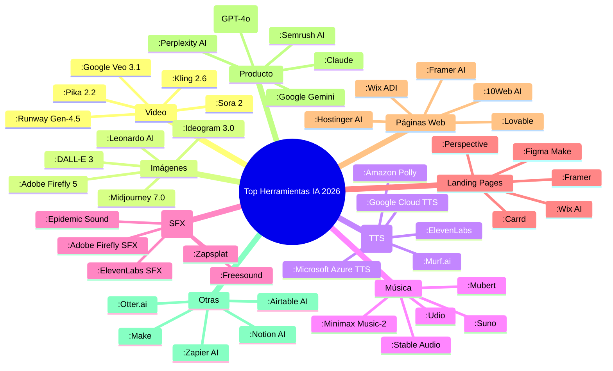

# 📚 Biblioteca de Herramientas de IA para Agencias y Profesionales (2026)

> Documento compilado a partir de fuentes actualizadas a 2026, categorizando herramientas de IA por función, con énfasis en planes gratuitos y usos profesionales.

---

## 🎬 1. Generación de Video con IA

| Herramienta | Enlace | Plan Gratuito / Notas | Comercial |
|-------------|--------|------------------------|-----------|
| **Runway Gen-4.5** | [runwayml.com](https://runwayml.com/) | Plan gratuito con créditos limitados; marca de agua | Sí, con planes de pago |
| **Sora 2** (OpenAI) | [openai.com/sora](https://openai.com/sora) | Acceso limitado a través de ChatGPT Plus | Sí, requiere suscripción |
| **Google Veo 3.1** | [ait.google.dev/veo](https://ait.google.dev/veo) | Disponible en Google AI Studio con límites gratuitos | Sí, a través de Vertex AI |
| **Pika 2.2** | [pika.art](https://pika.art/) | Plan gratuito con créditos diarios | Sí, planes premium |
| **Kling 2.6** | [klingai.com](https://klingai.com/) | Plan gratuito con marca de agua | Sí, muy popular en 2026 【turn0search0】 |
| **Wan 2.2** (Open Source) | [github.com/Wan-AI/Wan2.2](https://github.com/Wan-AI/Wan2.2) | Gratuita y ilimitada, pero requiere GPU local | Sí, código abierto |
| **ZSky AI** | [zsky.ai](https://zsky.ai/) | Plan gratuito ilimitado con marca de agua pequeña | Sí, incluye video con audio 【turn0search8】 |
| **Leonardo AI** | [leonardo.ai](https://leonardo.ai/) | 150 créditos diarios | Sí, planes premium |
| **Freepik AI** | [freepik.com](https://www.freepik.com/) | 20 créditos diarios gratis | Sí, con atribución en plan gratuito 【turn0search9】 |
| **Adobe Firefly** | [firefly.adobe.com](https://firefly.adobe.com/) | Ya no ofrece plan gratuito en 2026 | Sí, desde $9.99/mes 【turn0search8】 |
| **NightCafe** | [creator.nightcafe.studio](https://creator.nightcafe.studio/) | 5 créditos diarios | Sí, con créditos de pago |
| **Playground AI** | [playground.com](https://playground.com/) | ~100 generaciones diarias | Sí, planes premium |
| **Microsoft Designer** (Bing Image Creator) | [designer.microsoft.com](https://designer.microsoft.com/) | 15 boosts/día, luego ilimitado pero lento | Restringido por ToS 【turn0search8】 |
| **Ideogram** | [ideogram.ai](https://ideogram.ai/) | 10 créditos diarios, sin marca de agua | Sí, con derechos comerciales 【turn0search6】 |
| **Krea AI** | [krea.ai](https://krea.ai/) | Plan gratuito con cuota limitada | Sí, enfocado en diseñadores |
| **Stability AI** | [stability.ai](https://stability.ai/) | Acceso a modelos de código abierto como Stable Video Diffusion | Sí, para uso comercial |

---

## 🖼️ 2. Generación de Imágenes con IA

| Herramienta | Enlace | Plan Gratuito / Notas | Comercial |
|-------------|--------|------------------------|-----------|
| **Midjourney 7.0** | [midjourney.com](https://www.midjourney.com/) | No disponible en web, solo Discord; $10/mes plan básico | Sí, muy popular 【turn0search5】 |
| **DALL-E 3** (a través de ChatGPT) | [openai.com/dall-e-3](https://openai.com/dall-e-3) | Incluido en ChatGPT Plus ($20/mes) | Sí, con suscripción |
| **Adobe Firefly 5** | [firefly.adobe.com](https://firefly.adobe.com/) | Sin plan gratuito en 2026; desde $9.99/mes | Sí, entrenado con contenido con licencia 【turn0search8】 |
| **Leonardo AI** | [leonardo.ai](https://leonardo.ai/) | 150 créditos diarios; marca de agua | Sí, con planes premium |
| **Ideogram 3.0** | [ideogram.ai](https://ideogram.ai/) | 10 créditos diarios; sin marca de agua; **derechos comerciales** | Sí, excelente para texto en imágenes 【turn0search6】【turn0search9】 |
| **Krea AI** | [krea.ai](https://krea.ai/) | Plan gratuito con cuota limitada; canvas en tiempo real | Sí, para diseñadores |
| **ZSky AI** | [zsky.ai](https://zsky.ai/) | Ilimitado en plan gratuito; marca de agua pequeña | Sí, incluye video con audio 【turn0search8】 |
| **Playground AI** | [playground.com](https://playground.com/) | ~100 generaciones diarias; sin marca de agua | Sí, buenos para fotorrealismo |
| **Freepik AI** | [freepik.com](https://www.freepik.com/) | 20 créditos diarios; atribución requerida en uso comercial | Sí, modelos variados 【turn0search9】 |
| **NightCafe** | [creator.nightcafe.studio](https://creator.nightcafe.studio/) | 5 créditos diarios; comunidad activa | Sí, con créditos de pago |
| **Microsoft Designer** (Bing Image Creator) | [designer.microsoft.com](https://designer.microsoft.com/) | 15 boosts/día; marca de agua; uso comercial restringido | Restringido por ToS 【turn0search8】 |
| **Stability AI** (Stable Diffusion) | [stability.ai](https://stability.ai/) | Modelos de código abierto; uso libre | Sí, para uso comercial |
| **Meta AI** | [meta.ai](https://meta.ai/) | Integrado en plataformas de Meta; gratuito con cuenta | Sí, con limitaciones |
| **Canva AI** | [canva.com](https://www.canva.com/) | Generación de imágenes incluida en plan gratuito | Sí, con planes premium |
| **Bing Image Creator** (Copilot) | [bing.com/create](https://bing.com/create) | Ilimitado pero lento; marca de agua | Restringido por ToS 【turn0search6】 |
| **Gemini 3** (Nano Banana Pro) | [gemini.google.com](https://gemini.google.com/) | Disponible en Google AI Studio con límites gratuitos | Sí, a través de API |

---

## 🗣️ 3. Texto a Audio para Voces de Personajes (TTS)

| Herramienta | Enlace | Plan Gratuito / Notas | Comercial |
|-------------|--------|------------------------|-----------|
| **ElevenLabs** | [elevenlabs.io](https://elevenlabs.io/) | Plan gratuito con 10k caracteres/mes; voces realistas | Sí, muy popular para voces de personajes |
| **Murf.ai** | [murf.ai](https://murf.ai/) | Plan gratuito con 10 min de audio/mes; marca de agua | Sí, con biblioteca de voces |
| **Amazon Polly** | [aws.amazon.com/polly](https://aws.amazon.com/polly/) | Plan gratuito con 5 millones de caracteres/mes (primer año) | Sí, a través de AWS |
| **Google Cloud TTS** | [cloud.google.com/text-to-speech](https://cloud.google.com/text-to-speech) | Plan gratuito con 4 millones de caracteres/mes | Sí, a través de Google Cloud |
| **Microsoft Azure TTS** | [azure.microsoft.com/en-us/products/ai-services/text-to-speech](https://azure.microsoft.com/en-us/products/ai-services/text-to-speech) | Plan gratuito con 500k caracteres/mes | Sí, a través de Azure |
| **FineVoice** | [finevoice.ai](https://finevoice.ai/) | Plan gratuito sin registro; voces IA y efectos | Sí, para video y voz en off 【turn0search11】 |
| **Play.ht** | [play.ht](https://play.ht/) | Plan gratuito con 12.500 caracteres/mes | Sí, con voces ultra realistas |
| **Speechelo** | [speechelo.com](https://speechelo.com/) | Sin plan gratuito; pago único desde $47 | Sí, para videos de venta |
| **LOVO AI** | [lovo.ai](https://lovo.ai/) | Plan gratuito con 30 min de audio/mes | Sí, con 400+ voces |
| **Descript Overdub** | [descript.com/overdub](https://www.descript.com/overdub) | Incluido en plan gratuito de Descript; clonación de voz | Sí, para edición de audio |
| **Resemble AI** | [resemble.ai](https://www.resemble.ai/) | Plan gratuito con 10 seg de clonación de voz | Sí, para voces personalizadas |
| **Voicebooking** | [voicebooking.com](https://www.voicebooking.com/) | Sin plan gratuito; servicios de voz profesional | Sí, voces humanas e IA |
| **NaturalReader** | [naturalreader.com](https://www.naturalreader.com/) | Plan gratuito con voces estándar; límite diario | Sí, para uso personal y comercial |
| **TTSReader** | [ttsreader.com](https://ttsreader.com/) | Completamente gratuito; sin cuenta necesaria | Sí, para uso básico |
| **FromTextToSpeech** | [fromtexttospeech.com](https://www.fromtexttospeech.com/) | Gratuito con límites; voces sintéticas | Sí, para proyectos simples |

---

## 🎵 4. Generación de Música con IA

| Herramienta | Enlace | Plan Gratuito / Notas | Comercial |
|-------------|--------|------------------------|-----------|
| **Suno** | [suno.com](https://suno.com/) | Plan gratuito con 50 créditos/día; calidad excelente | Sí, muy popular en 2026 【turn0search15】 |
| **Minimax Music-2** | [minimax.ai](https://www.minimax.ai/) | 10.000 créditos iniciales; calidad alta | Sí, con herramientas de voz 【turn0search15】 |
| **Udio** | [udio.com](https://www.udio.com/) | Plan gratuito con 10 generaciones/día; calidad de audio superior | Sí, para música y efectos |
| **Mureka** | [mureka.ai](https://www.mureka.ai/) | Plan gratuito con cuota limitada; herramientas de edición de pago | Sí, competidor emergente 【turn0search15】 |
| **Stable Audio** | [stableaudio.com](https://www.stableaudio.com/) | Plan gratuito con 20 generaciones/mes; 45 seg de duración | Sí, para música y efectos |
| **Eleven Music** | [elevenmusic.io](https://www.elevenmusic.io/) | Plan gratuito con cuota limitada; voces y música | Sí, de ElevenLabs |
| **Sonauto** | [sonauto.ai](https://www.sonauto.ai/) | Plan gratuito con 5 canciones/mes | Sí, para música instrumental |
| **MusicHero.ai** | [musichero.ai](https://www.musichero.ai/) | Sin registro; generación gratuita | Sí, para uso básico |
| **Mubert** | [mubert.com](https://www.mubert.com/) | Plan gratuito con 25 pistas/mes; instrumental | Sí, para música de fondo 【turn0search16】 |
| **ACE-Step** | [ace-step.com](https://www.ace-step.com/) | Completamente gratuito y de código abierto | Sí, para uso comercial |
| **Tad AI** | [tad.ai](https://tad.ai/) | Plan gratuito con 10 generaciones/mes | Sí, para música royalty-free 【turn0search19】 |
| **Boomy** | [boomy.com](https://www.boomy.com/) | Creación gratuita; monetización a través de streaming | Sí, para distribución |
| **AIVA** | [aiva.ai](https://www.aiva.ai/) | Plan gratuito con 3 descargas/mes; música orquestal | Sí, para compositores |
| **Soundraw** | [soundraw.io](https://soundraw.io/) | Plan gratuito con 5 pistas/mes; personalizable | Sí, para creadores de contenido |
| **Ecrett Music** | [ecrettmusic.com](https://www.secrettmusic.com/) | Plan gratuito con 10 pistas/mes; más de 500 estilos | Sí, para videos y juegos |

---

## 🔊 5. Generación de Audio de Efectos Especiales (SFX)

| Herramienta | Enlace | Plan Gratuito / Notas | Comercial |
|-------------|--------|------------------------|-----------|
| **Adobe Firefly SFX** | [firefly.adobe.com/sfx](https://firefly.adobe.com/sfx) | Sin plan gratuito en 2026; incluido en plan de pago | Sí, integrado con Adobe 【turn0search22】 |
| **ElevenLabs SFX** | [elevenlabs.io/sound-effects](https://elevenlabs.io/sound-effects) | Plan gratuito con 10k caracteres/mes (incluye SFX) | Sí, de ElevenLabs 【turn0search21】 |
| **Kling SFX** | [klingai.com/sfx](https://klingai.com/sfx) | Plan gratuito con créditos diarios; marca de agua | Sí, de Kling AI |
| **Foximusic** | [foximusic.com](https://www.foximusic.com/) | Generación gratuita sin registro; descarga directa | Sí, para YouTube y TikTok 【turn0search23】 |
| **Epidemic Sound** | [epidemicsound.com](https://www.epidemicsound.com/) | No gratuito; biblioteca de SFX con licencia | Sí, para uso profesional 【turn0search24】 |
| **Zapsplat** | [zapsplat.com](https://www.zapsplat.com/) | Biblioteca gratuita con cuenta; más de 100,000 SFX | Sí, con atribución |
| **Freesound** | [freesound.org](https://freesound.org/) | Biblioteca gratuita de SFX de código abierto | Sí, con licencias Creative Commons |
| **AudioJungle** | [audiojungle.net](https://audiojungle.net/) | No gratuito; SFX premium a la venta | Sí, para uso comercial |
| **Soundsnap** | [soundsnap.com](https://www.soundsnap.com/) | No gratuito; biblioteca de SFX con licencia | Sí, para profesionales |
| **BBC Sound Effects** | [bbc.co.uk/soundeffects](https://www.bbc.co.uk/soundeffects) | Biblioteca gratuita para uso personal; licencia para comercial | Sí, con restricciones |
| **YouTube Audio Library** | [youtube.com/audiolibrary](https://www.youtube.com/audiolibrary) | Biblioteca gratuita de SFX y música; uso en YouTube | Sí, para videos de YouTube |
| **Mixkit** | [mixkit.co](https://mixkit.co/) | Biblioteca gratuita de SFX y música; sin atribución | Sí, para proyectos comerciales |
| **Pikbest** | [pikbest.com](https://pikbest.com/) | Algunos SFX gratuitos con cuenta; biblioteca premium | Sí, para diseño audiovisual |
| **99Sounds** | [99sounds.org](https://99sounds.org/) | Biblioteca gratuita de SFX de alta calidad | Sí, para uso comercial |
| **SoundBible** | [soundbible.com](https://www.soundbible.com/) | SFX gratuitos y premium; licencias variadas | Sí, para diferentes proyectos |

---

## 🚀 6. Generación de Landing Pages con IA

| Herramienta | Enlace | Plan Gratuito / Notas | Comercial |
|-------------|--------|------------------------|-----------|
| **Carrd** | [carrd.co](https://carrd.co/) | Plan gratuito con 3 sitios; sin anuncios | Sí, muy popular para landing pages simples 【turn0search28】 |
| **Framer** | [framer.com](https://www.framer.com/) | Plan gratuito con 1 proyecto; marca de agua | Sí, para diseñadores |
| **Wix AI** | [wix.com/ai-website-builder](https://wix.com/ai-website-builder) | Plan gratuito con Wix branding; dominio .wixsite.com | Sí, para sitios completos 【turn0search34】 |
| **Figma Make** | [figma.com/solutions/ai-landing-page-generator](https://www.figma.com/solutions/ai-landing-page-generator) | Plan gratuito con 3 proyectos; colaboración en tiempo real | Sí, para diseño colaborativo 【turn0search29】 |
| **Perspective** | [perspective.co](https://www.perspective.co/) | Prueba gratuita; planes desde $19/mes | Sí, para páginas de alta conversión 【turn0search26】 |
| **Lovable** | [lovable.dev](https://lovable.dev/) | Plan gratuito con 1 proyecto; generación con IA | Sí, para landing pages y web apps |
| **10Web** | [10web.io](https://10web.io/) | Plan gratuito con 1 sitio; WordPress automatizado | Sí, para WordPress |
| **Neo Sites** | [neosites.com](https://www.neosites.com/) | Plan gratuito con 1 sitio; marca de agua | Sí, para creadores 【turn0search30】 |
| **Olitt** | [olitt.com](https://www.olitt.com/) | Plan gratuito con 1 sitio; plantillas modernas | Sí, para pequeñas empresas |
| **Tithely Sites** | [tithely.com/sites](https://tithely.com/sites) | Plan gratuito para iglesias; sin marca de agua | Sí, para organizaciones religiosas |
| **Design.com** | [design.com](https://www.design.com/) | Prueba gratuita; creador con IA | Sí, para diseño gráfico y web |
| **GoDaddy AI** | [godaddy.com/ai-website-builder](https://www.godaddy.com/ai-website-builder) | Plan gratuito con dominio .godaddysites.com | Sí, para principiantes |
| **Hostinger AI** | [hostinger.com/ai-website-builder](https://www.hostinger.com/ai-website-builder) | Plan gratuito con 1 sitio; 100 plantillas | Sí, para hosting y web |
| **WordPress.com** | [wordpress.com](https://wordpress.com/) | Plan gratuito con 3GB de espacio; subdominio | Sí, para blogs y sitios |
| **Webflow** | [webflow.com](https://www.webflow.com/) | Plan gratuito con 2 proyectos; CMS limitado | Sí, para diseñadores avanzados |

---

## 🌐 7. Generación de Páginas Web Completas con IA

| Herramienta | Enlace | Plan Gratuito / Notas | Comercial |
|-------------|--------|------------------------|-----------|
| **Wix ADI** | [wix.com/adi](https://wix.com/adi) | Plan gratuito con Wix branding; dominio .wixsite.com | Sí, para sitios completos 【turn0search34】 |
| **Framer AI** | [framer.com/ai](https://www.framer.com/ai) | Plan gratuito con 1 proyecto; marca de agua | Sí, para sitios animados |
| **10Web AI** | [10web.io/ai-website-builder](https://10web.io/ai-website-builder) | Plan gratuito con 1 sitio; WordPress automatizado | Sí, para WordPress |
| **Lovable** | [lovable.dev](https://lovable.dev/) | Plan gratuito con 1 proyecto; generación completa con IA | Sí, para web apps y sitios |
| **Hostinger AI** | [hostinger.com/ai-website-builder](https://www.hostinger.com/ai-website-builder) | Plan gratuito con 1 sitio; 100 plantillas | Sí, para hosting y web |
| **GoDaddy AI** | [godaddy.com/ai-website-builder](https://www.godaddy.com/ai-website-builder) | Plan gratuito con dominio .godaddysites.com | Sí, para principiantes |
| **WordPress.com AI** | [wordpress.com/ai](https://wordpress.com/ai) | Plan gratuito con 3GB de espacio; subdominio | Sí, para blogs y sitios |
| **Webflow AI** | [webflow.com/ai](https://www.webflow.com/ai) | Plan gratuito con 2 proyectos; CMS limitado | Sí, para diseñadores avanzados |
| **Figma AI** | [figma.com/ai](https://www.figma.com/ai) | Plan gratuito con 3 proyectos; colaboración en tiempo real | Sí, para diseño colaborativo |
| **Squarespace AI** | [squarespace.com/ai](https://www.squarespace.com/ai) | Prueba gratuita de 14 días; sin plan gratuito | Sí, para sitios profesionales |
| **Shopify AI** | [shopify.com/ai](https://www.shopify.com/ai) | Prueba gratuita de 3 días; para e-commerce | Sí, para tiendas online |
| **Durable AI** | [durable.co](https://durable.co/) | Plan gratuito con 1 sitio; marca de agua | Sí, para sitios de servicios |
| **Mixo** | [mixo.io](https://mixo.io/) | Plan gratuito con 1 sitio; generación en 30 segundos | Sí, para landing pages |
| **Pineapple AI** | [pineapple.build](https://pineapple.build/) | Plan gratuito con 1 sitio; plantillas editables | Sí, para agencias |
| **CodeDesign AI** | [codedesign.ai](https://codedesign.ai/) | Plan gratuito con 1 sitio; código exportable | Sí, para desarrolladores |

---

## 📈 8. Optimización y Generación de Productos con IA

| Herramienta | Enlace | Plan Gratuito / Notas | Comercial |
|-------------|--------|------------------------|-----------|
| **ChatGPT (GPT-4o)** | [chat.openai.com](https://chat.openai.com/) | Plan gratuito con GPT-3.5; GPT-4o con suscripción | Sí, para escribir especificaciones y PRDs 【turn0search39】 |
| **Claude** | [claude.ai](https://claude.ai/) | Plan gratuito con uso limitado; excelente para análisis | Sí, de Anthropic |
| **Google Gemini** | [gemini.google.com](https://gemini.google.com/) | Plan gratuito con límites; integración con Google Workspace | Sí, para productividad |
| **Perplexity AI** | [perplexity.ai](https://www.perplexity.ai/) | Plan gratuito con búsquedas limitadas; respuestas con fuentes | Sí, para investigación |
| **ChatPRD** | [chatprd.ai](https://chatprd.ai/) | Sin plan gratuito; especializado en PRDs y requisitos | Sí, para product managers 【turn0search38】 |
| **Productboard AI** | [productboard.com](https://www.productboard.com/) | Prueba gratuita; para roadmaps y priorización | Sí, para gestión de productos |
| **Semrush AI** | [semrush.com](https://www.semrush.com/) | Prueba gratuita; para SEO y análisis de competencia | Sí, para marketing 【turn0search37】 |
| **Surfer SEO** | [surferseo.com](https://surferseo.com/) | Prueba gratuita; para optimización de contenido SEO | Sí, para agencias |
| **Clearscope** | [clearscope.com](https://clearscope.com/) | Prueba gratuita; para optimización de contenido | Sí, para equipos de contenido |
| **Rewarx** | [rewarx.com](https://www.rewarx.com/) | Prueba gratuita; para optimización de listados de e-commerce | Sí, para vendedores online 【turn0search35】 |
| **Jasper AI** | [jasper.ai](https://www.jasper.ai/) | Prueba gratuita; para generación de contenido de marketing | Sí, para copywriting |
| **Copy.ai** | [copy.ai](https://www.copy.ai/) | Plan gratuito con 2000 palabras/mes; para copywriting | Sí, para startups |
| **Writesonic** | [writesonic.com](https://writesonic.com/) | Plan gratuito con 10k palabras/mes; para artículos y anuncios | Sí, para agencias |
| **Rytr** | [rytr.com](https://rytr.com/) | Plan gratuito con 5000 caracteres/mes; para short-form | Sí, para uso personal |
| **Anyword** | [anyword.com](https://www.anyword.com/) | Prueba gratuita; para copywriting con predicción de rendimiento | Sí, para equipos de marketing |

---

## 🛠️ 9. Otras Herramientas Útiles para Agencias

| Herramienta | Enlace | Plan Gratuito / Notas | Comercial |
|-------------|--------|------------------------|-----------|
| **Notion AI** | [notion.so/ai](https://www.notion.so/ai) | Plan gratuito con 20 respuestas AI/mes; para notas y documentos | Sí, para gestión de proyectos |
| **Zapier AI** | [zapier.com/ai](https://zapier.com/ai) | Plan gratuito con 100 tareas/mes; para automatización | Sí, para integraciones |
| **Make (Integromat)** | [make.com](https://www.make.com/) | Plan gratuito con 1000 operaciones/mes; para automatización | Sí, para flujos de trabajo |
| **Airtable AI** | [airtable.com/ai](https://www.airtable.com/ai) | Plan gratuito con 1200 registros; para bases de datos | Sí, para gestión de datos |
| **Monday AI** | [monday.com/ai](https://monday.com/ai) | Plan gratuito con 2 asientos; para gestión de proyectos | Sí, para equipos |
| **ClickUp AI** | [clickup.com/ai](https://clickup.com/ai) | Plan gratuito con 100MB almacenamiento; para gestión de tareas | Sí, para productividad |
| **Slack AI** | [slack.com/ai](https://slack.com/ai) | Plan gratuito con 90 días de historial; para comunicación | Sí, para equipos |
| **Microsoft 365 Copilot** | [microsoft.com/365/copilot](https://www.microsoft.com/365/copilot) | No gratuito; incluido en planes de Microsoft 365 | Sí, para oficina |
| **Google Workspace AI** | [workspace.google.com/ai](https://workspace.google.com/ai) | No gratuito; incluido en planes de Google Workspace | Sí, para colaboración |
| **Zoom AI** | [zoom.com/ai](https://www.zoom.com/ai) | Plan gratuito con reuniones de 40 min; para videollamadas | Sí, para reuniones |
| **Otter.ai** | [otter.ai](https://otter.ai/) | Plan gratuito con 300 min/mes; para transcripción de reuniones | Sí, para notas |
| **Fireflies.ai** | [fireflies.ai](https://www.fireflies.ai/) | Plan gratuito con 800 min/mes; para grabación y transcripción | Sí, para reuniones |
| **Beautiful.ai** | [beautiful.ai](https://www.beautiful.ai/) | Prueba gratuita; para presentaciones con IA | Sí, para presentaciones |
| **Gamma AI** | [gamma.app](https://gamma.app/) | Plan gratuito con 400 créditos; para presentaciones y documentos | Sí, para contenido visual |
| **Tome AI** | [tome.app](https://tome.app/) | Plan gratuito con 500 créditos; para presentaciones narrativas | Sí, para storytelling |

---

## 🏆 Top Herramientas Más Utilizadas en la Industria (2026)

A continuación, un top 5 por categoría basado en popularidad, usabilidad y adopción en la industria:

### 📊 Detalle del Top por Categoría

#### 🎬 Generación de Video
1.  **Runway Gen-4.5** - Líder en creatividad y control profesional.
2.  **Kling 2.6** - Muy popular en 2026, con 60M+ de creadores 【turn0search0】.
3.  **Sora 2** (OpenAI) - Calidad excepcional, pero acceso limitado.
4.  **Google Veo 3.1** - Integración con ecosistema Google.
5.  **Pika 2.2** - Buena relación calidad-precio.

#### 🖼️ Generación de Imágenes
1.  **Midjourney 7.0** - Referencia en calidad artística 【turn0search5】.
2.  **DALL-E 3** (ChatGPT) - Accesible y versátil.
3.  **Leonardo AI** - Excelente para estilos variados y gratuita.
4.  **Ideogram 3.0** - Mejor para imágenes con texto y uso comercial 【turn0search6】.
5.  **Adobe Firefly 5** - Integración perfecta con Adobe, pero de pago.

#### 🗣️ Voz de Personajes (TTS)
1.  **ElevenLabs** - Voces más realistas y naturales.
2.  **Murf.ai** - Amplia biblioteca de voces y estilos.
3.  **Amazon Polly** - Integración robusta con AWS.
4.  **Google Cloud TTS** - Voces de alta calidad y gran integración.
5.  **Microsoft Azure TTS** - Buena opción para empresas.

#### 🎵 Música
1.  **Suno** - Calidad superior y editor integrado 【turn0search15】.
2.  **Minimax Music-2** - Alta calidad y herramientas de voz.
3.  **Udio** - Mejor calidad de audio gratuita.
4.  **Stable Audio** - Modelo de código abierto confiable.
5.  **Mubert** - Perfecto para música instrumental de fondo.

#### 🔊 Efectos Especiales (SFX)
1.  **Adobe Firefly SFX** - Integración con Premiere Pro.
2.  **ElevenLabs SFX** - Generación desde texto, fácil de usar.
3.  **Epidemic Sound** - Biblioteca premium con licencia clara.
4.  **Zapsplat** - Biblioteca gratuita enorme con cuenta.
5.  **Freesound** - Comunidad y recursos de código abierto.

#### 🚀 Landing Pages
1.  **Carrd** - Simple, rápido y gratuito para necesidades básicas.
2.  **Framer** - Diseño avanzado y animaciones.
3.  **Wix AI** - Solución completa para principiantes.
4.  **Figma Make** - Colaboración en tiempo real y diseño.
5.  **Perspective** - Enfocado en conversión y A/B testing.

#### 🌐 Páginas Web
1.  **Wix ADI** - IA más madura para sitios completos.
2.  **Framer AI** - Para diseñadores que buscan control y animación.
3.  **10Web AI** - Mejor para WordPress automatizado.
4.  **Lovable** - Para web apps y sitios dinámicos.
5.  **Hostinger AI** - Buena relación calidad-precio con hosting incluido.

#### 📈 Producto y Optimización
1.  **ChatGPT (GPT-4o)** - Herramienta todo en uno para product managers.
2.  **Claude** - Excelente para análisis y razonamiento complejo.
3.  **Google Gemini** - Integración con Google Workspace.
4.  **Perplexity AI** - Para investigación con fuentes verificadas.
5.  **Semrush AI** - Líder en SEO y análisis de competencia.

#### 🛠️ Otras (Productividad)
1.  **Notion AI** - Organización y documentos con IA.
2.  **Zapier AI** - Automatización de tareas entre apps.
3.  **Make (Integromat)** - Flujos de trabajo visuales y automatización.
4.  **Airtable AI** - Bases de datos inteligentes.
5.  **Otter.ai** - Transcripción de reuniones en tiempo real.

---

## 💡 Conclusión y Recomendaciones para Agencias

-   **Para empezar**: Prioriza herramientas con **planes gratuitos generosos** como Leonardo AI, Ideogram, Suno, ElevenLabs y Carrd. Te permitirán probar sin inversión.
-   **Para uso comercial**: Verifica siempre los **derechos de uso comercial**. Ideogram y ZSky AI ofrecen derechos completos en sus planes gratuitos, lo cual es excelente para agencias.
-   **Para escalabilidad**: Invierte en herramientas de **pago por valor** como Runway, Midjourney, ElevenLabs y ChatGPT Plus cuando los límites gratuitos sean un obstáculo.
-   **Para integraciones**: Considera herramientas como **Zapier** o **Make** para conectar tus herramientas de IA favoritas y automatizar flujos de trabajo.
-   **Para colaboración**: Herramientas como **Figma**, **Notion** y **Airtable** con IA integrada facilitan el trabajo en equipo.

> ⚠️ **Nota**: Los enlaces y planes gratuitos pueden cambiar. Se recomienda verificar directamente en los sitios oficiales antes de comprometerse con un plan de pago.

---

