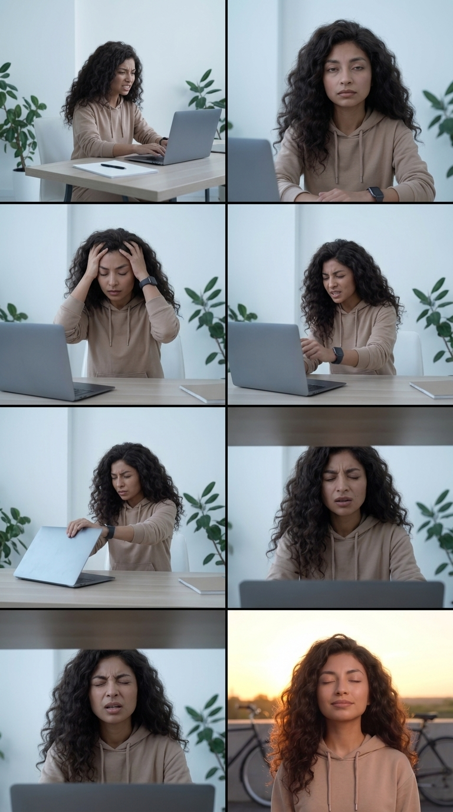
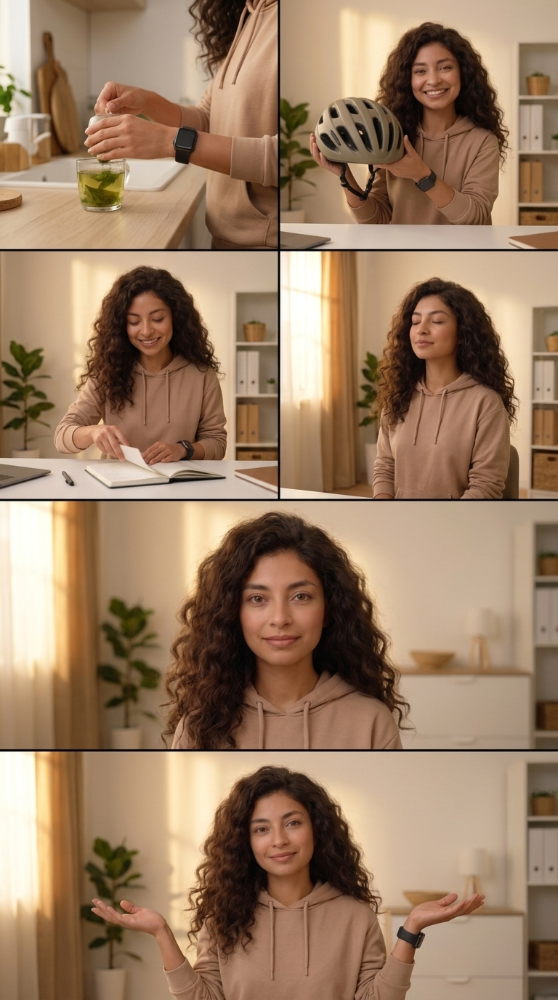

# STORYBOARD: Lo que realmente me redujo el cortisol
**Proyecto:** 0001-lo-que-redujo-el-cortisol
**Reparto (Lore):** [lia]

---

## BLOQUE 1: EL AGOBIO (Tomas 1 - 6)

*LORE GLOSSARY:*
*[lia] = A resilient and intelligent woman with a warm, empathetic gaze. Active and healthy complexion. Wearing comfortable casual work-from-home clothes. Wearing a smartwatch. Color palette features clean whites, warm earthy tones, and organic greens.*

*PROMPT:*
*A 6-panel comic-style storyboard layout (2 rows of 3 panels). Background for all panels: A cozy, minimalist home office illuminated by soft sunlight, clean whites and organic greens from indoor plants. Panel 1: CU (Close Up) of [lia] sitting at her desk, typing fast, looking frustrated. Cold, desaturated color grade. Panel 2: ECU (Extreme Close Up) of [lia] looking directly at the camera, visibly exhausted. Cold, desaturated color grade. Panel 3: MS (Medium Shot) of [lia] holding her head in her hands, looking overwhelmed. Cold, desaturated color grade. Panel 4: CU of [lia] aggressively slamming her laptop shut. Cold, desaturated color grade. Panel 5: Low angle MS of [lia] sighing heavily and squeezing her eyes shut in tension. Cold, desaturated color grade. Panel 6: Match cut to MS of [lia] outdoors at sunset with her eyes still closed, but her face is now relaxed and peaceful. A bicycle is slightly visible in the background. Warm golden hour lighting. CRITICAL: Do not include any text, letters, subtitles, words, or speech bubbles anywhere in the image. The image must be completely free of typography. --ar 9:16 --v 6.0*

### Toma 1 (Hook A)
- **Toma:** 1
- **Thumbnail (Visual):** LIA tecleando rápido, frustrada.
- **Acción/Narrativa:** Frustración al buscar información sobre inflamación.
- **Cámara y Fotografía:**
  - **Plano:** CU (Close Up) / Lente 24mm f/1.8
  - **Movimiento de cámara:** Fijo
  - **Iluminación:** Luz suave pero direccional
  - **Color Grading:** Desaturado/Frío
- **Duración:** 0:00 - 0:02
- **Audio/Voz en Off:** "Cuando tienes Artritis o dolor crónico..."
- **Transición:** Push-in rápido

### Toma 2 (Hook B)
- **Toma:** 2
- **Thumbnail (Visual):** LIA mira a la cámara, visiblemente agotada.
- **Acción/Narrativa:** Rompe la cuarta pared para conectar con la audiencia agotada.
- **Cámara y Fotografía:**
  - **Plano:** ECU (Extreme Close Up)
  - **Movimiento de cámara:** Push-in rápido a LIA
  - **Iluminación:** Luz fría de ventana
  - **Color Grading:** Desaturado/Frío
- **Duración:** 0:02 - 0:04
- **Audio/Voz en Off:** "...te juran que para bajar la inflamación tienes que hacer TODO esto:"
- **Transición:** Corte abrupto (Hard Cut)

### Toma 3 (Mito 1)
- **Toma:** 3
- **Thumbnail (Visual):** LIA se agarra la cabeza.
- **Acción/Narrativa:** Primer mito abrumador (suplementos).
- **Cámara y Fotografía:**
  - **Plano:** MS (Medium Shot)
  - **Movimiento de cámara:** Handheld Shaky cam (inestable)
  - **Iluminación:** Dura, estresante
  - **Color Grading:** Desaturado/Frío
- **Duración:** 0:04 - 0:06
- **Audio/Voz en Off:** "Tomar mil suplementos caros..."
- **Transición:** Snap Zoom rápido

### Toma 4 (Mito 2)
- **Toma:** 4
- **Thumbnail (Visual):** LIA cierra su laptop de golpe.
- **Acción/Narrativa:** Agobio por meditación forzada con dolor.
- **Cámara y Fotografía:**
  - **Plano:** CU (Close Up)
  - **Movimiento de cámara:** Snap zoom siguiendo la acción
  - **Iluminación:** Dura, contrastada
  - **Color Grading:** Desaturado/Frío
- **Duración:** 0:06 - 0:08
- **Audio/Voz en Off:** "...meditar horas enteras aunque te duela el cuerpo..."
- **Transición:** Corte inestable

### Toma 5 (Mito 3)
- **Toma:** 5
- **Thumbnail (Visual):** LIA suspira harta y cierra los ojos con fuerza (tensión).
- **Acción/Narrativa:** Colapso por intentar cumplir con el "fitness perfecto".
- **Cámara y Fotografía:**
  - **Plano:** Low Angle MS (Contrapicado Medio)
  - **Movimiento de cámara:** Handheld inestable
  - **Iluminación:** Luz cenital dura
  - **Color Grading:** Desaturado/Frío
- **Duración:** 0:08 - 0:11
- **Audio/Voz en Off:** "...o matarte entrenando. Intentar cumplir eso te sube más el cortisol."
- **Transición:** Match Cut (de ojos cerrados a ojos cerrados)

### Toma 6 (Transición)
- **Toma:** 6
- **Thumbnail (Visual):** Pasamos a LIA (o ciclista) con los ojos cerrados, pero ahora relajando el rostro frente al atardecer.
- **Acción/Narrativa:** El alivio físico y el cambio de paradigma mental.
- **Cámara y Fotografía:**
  - **Plano:** MS (Medium Shot) / Lente 50mm
  - **Movimiento de cámara:** Estabilizado (Steadicam) fluido
  - **Iluminación:** Golden Hour (Luz dorada cálida envolvente)
  - **Color Grading:** Tonos Miel/Golden Hour
- **Duración:** 0:11 - 0:14
- **Audio/Voz en Off:** *(Voz brillante)* "Pero tras más de 20 años con la enfermedad, la experiencia me enseñó otro camino."
- **Transición:** Disolvencia suave

---

## BLOQUE 2: LA SANACIÓN (Tomas 7 - 12)

*LORE GLOSSARY:* (Idéntico al Bloque 1)

*PROMPT:*
*A 6-panel comic-style storyboard layout (2 rows of 3 panels). Panel 1: ECU (Extreme Close Up) of [lia]'s hands preparing a healthy green organic herbal tea in a cozy minimalist kitchen. Shallow depth of field, f/1.4, cinematic bokeh. Warm honey-toned lighting. Panel 2: CU (Close Up) of [lia] smiling proudly while holding up a cycling helmet to the camera in her minimalist office. Shallow depth of field, f/1.4, cinematic bokeh. Warm honey-toned lighting. Panel 3: MS (Medium Shot) of [lia] in her office, smiling peacefully as she closes a data log notebook and puts down a pen. Warm honey-toned lighting. Panel 4: CU of [lia] sitting in her office, eyes gently closed, taking a deep relaxing breath illuminated by soft sunlight. Warm honey-toned lighting. Panel 5: CU of [lia] looking directly at the camera with extreme empathy and wisdom in a perfectly symmetrical office framing. Warm honey-toned lighting. Panel 6: MS of [lia] shrugging her shoulders in a relaxed, peaceful manner while smiling gently at the camera. Warm honey-toned lighting. CRITICAL: Do not include any text, letters, subtitles, words, or speech bubbles anywhere in the image. The image must be completely free of typography. --ar 9:16 --v 6.0*

### Toma 7 (Solución 1)
- **Toma:** 7
- **Thumbnail (Visual):** Plano detalle (Macro) de LIA preparando una infusión verde orgánica.
- **Acción/Narrativa:** Sanación desde adentro (el microbioma).
- **Cámara y Fotografía:**
  - **Plano:** ECU (Extreme Close Up) / Macro Lens
  - **Movimiento de cámara:** Slow dolly in
  - **Iluminación:** Luz cálida filtrada
  - **Color Grading:** Tonos Miel cálidos, Bokeh f/1.4
- **Duración:** 0:14 - 0:19
- **Audio/Voz en Off:** "Por lo menos a mí, lo que de verdad me reguló el sistema nervioso fue: sanar mi intestino..."
- **Transición:** Corte orgánico fluido

### Toma 8 (Solución 2)
- **Toma:** 8
- **Thumbnail (Visual):** LIA sonríe orgullosa mientras sostiene y muestra su casco de ciclismo ("armadura").
- **Acción/Narrativa:** Presentación tangible de su solución de bajo impacto.
- **Cámara y Fotografía:**
  - **Plano:** CU (Close Up)
  - **Movimiento de cámara:** Movimiento orgánico estabilizado
  - **Iluminación:** Luz lateral cálida (Rembrandt lighting)
  - **Color Grading:** Tonos Miel, Bokeh f/1.4
- **Duración:** 0:19 - 0:22
- **Audio/Voz en Off:** "...descubrir la libertad del ciclismo de bajo impacto..."
- **Transición:** Wipe o corte fluido por movimiento

### Toma 9 (Solución 3)
- **Toma:** 9
- **Thumbnail (Visual):** LIA cerrando tranquilamente su bitácora de datos y soltando el bolígrafo.
- **Acción/Narrativa:** El alivio psicológico de dejar el perfeccionismo.
- **Cámara y Fotografía:**
  - **Plano:** MS (Medium Shot)
  - **Movimiento de cámara:** Dolly out sutil
  - **Iluminación:** Soft Key Light (Luz Principal Suave)
  - **Color Grading:** Tonos Miel
- **Duración:** 0:22 - 0:26
- **Audio/Voz en Off:** "...soltar la pesada carga de sobrepensarlo todo..."
- **Transición:** Disolvencia rápida a luz

### Toma 10 (Solución 4)
- **Toma:** 10
- **Thumbnail (Visual):** LIA cierra los ojos iluminada por el sol, respirando profundo.
- **Acción/Narrativa:** Integración del cuerpo y mente a través del oxígeno.
- **Cámara y Fotografía:**
  - **Plano:** CU (Close Up)
  - **Movimiento de cámara:** Estático, enfoque perfecto
  - **Iluminación:** Luz de atardecer bañando su rostro (Sun Flare sutil)
  - **Color Grading:** Tonos Miel muy dorados
- **Duración:** 0:26 - 0:30
- **Audio/Voz en Off:** "...y aprender a respirar. Ese fue mi verdadero Plan de Guerra."
- **Transición:** Match Cut a simetría

### Toma 11 (Cierre A)
- **Toma:** 11
- **Thumbnail (Visual):** LIA mira a cámara, encuadre perfectamente simétrico.
- **Acción/Narrativa:** Empatía pura, hablando de humana a humana.
- **Cámara y Fotografía:**
  - **Plano:** CU (Close Up) Simétrico (Estilo Wes Anderson dramático)
  - **Movimiento de cámara:** Completamente fijo en trípode
  - **Iluminación:** Soft Key + Fill (Sin sombras duras en el rostro)
  - **Color Grading:** Tonos Miel equilibrados
- **Duración:** 0:30 - 0:35
- **Audio/Voz en Off:** *(Tono sabio)* "Ojo, esto no está escrito en piedra. Algunas cosas te funcionarán, otras no... y está bien."
- **Transición:** Corte directo (Hard Cut pacífico)

### Toma 12 (Cierre B)
- **Toma:** 12
- **Thumbnail (Visual):** LIA se encoge de hombros relajada y sonríe.
- **Acción/Narrativa:** Relajar por completo las expectativas de la audiencia.
- **Cámara y Fotografía:**
  - **Plano:** MS (Medium Shot)
  - **Movimiento de cámara:** Estático
  - **Iluminación:** Soft Key
  - **Color Grading:** Tonos Miel
- **Duración:** 0:35 - 0:40
- **Audio/Voz en Off:** "Arma tu propia estrategia, a tu ritmo y sin estrés."
- **Transición:** Fade to Black lento (2 segundos)
