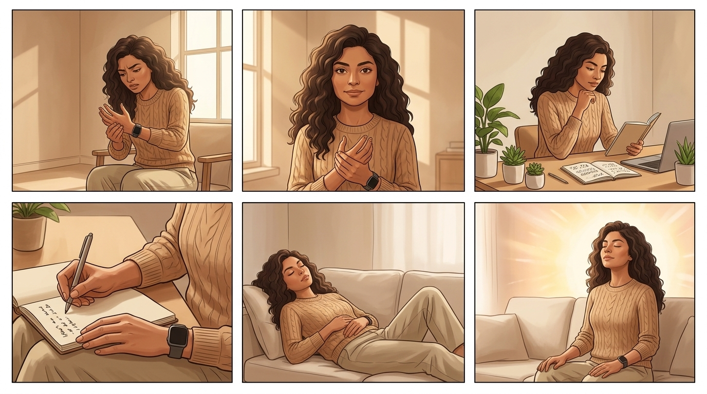
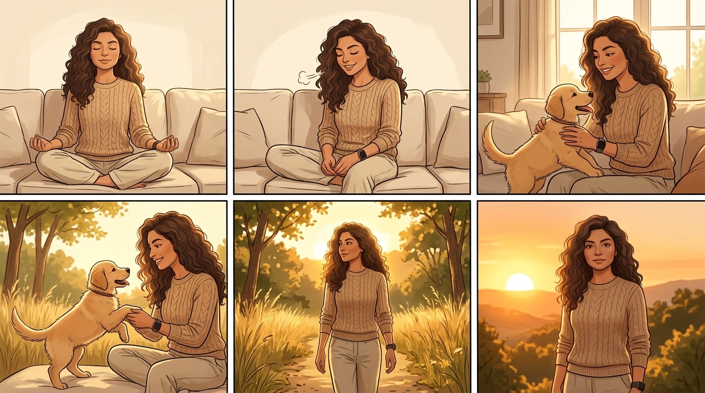

# STORYBOARD: El Nervio Vago: Tu Interruptor Anti-Dolor
**Reparto (Lore):** [lia_respiracion]

## BLOQUE 1: Escenas 1 a 6

*LORE GLOSSARY:* 
*[lia_respiracion] = A resilient and intelligent woman with a warm, empathetic gaze. Active and healthy complexion. Wearing comfortable, clean casual work-from-home clothes in warm earthy and light tones. Always wears a smartwatch.*

*PROMPT:* 
*Minimalista, estetica de bitacora, tonos calidos, NO estetica de hospital. A 6-panel comic-style storyboard layout (2 rows of 3 panels). CRITICAL: Do not include any text, letters, subtitles, words, or speech bubbles anywhere in the image. The image must be completely free of typography. Panel 1: [lia_respiracion] in an interior minimalist room with warm light, looking at her smartwatch with frustration, rubbing her hand joints. Panel 2: [lia_respiracion] in the same interior minimalist room, looking directly at the camera with an understanding and empathetic expression. Panel 3: [lia_respiracion] at an interior desk with a laptop and plants, looking analytical while reading a data log notebook. Panel 4: Close up on the hands of [lia_respiracion] writing in a notebook, organic colors and natural light. Panel 5: [lia_respiracion] sitting on a comfortable interior sofa, eyes closed, placing one hand on her abdomen. Panel 6: [lia_respiracion] sitting on the sofa, deeply inhaling and inflating her abdomen, with a hopeful and bright light.*

### Toma 1 (Hook A)
- **Toma:** 1
- **Thumbnail (Visual):** [Interior. Escritorio, luz de pantalla]. LIA muy estresada frente a su laptop. Frustrada, se frota las articulaciones de las manos con dolor visible.
- **Acción/Narrativa:** El estrés del trabajo (código que no funciona) detona inmediatamente una respuesta de dolor físico articular.
- **Cámara y Fotografía:**
  - **Plano:** ECU (Extreme Close Up) a rostro estresado iluminado por pantalla, seguido de rápido whip pan a sus manos.
  - **Movimiento de cámara:** Whip pan rápido (tensión).
  - **Iluminación:** Luz fría de la pantalla contrastando con fondo cálido apagado.
  - **Color Grading:** Alto contraste, desaturado para marcar el dolor.
- **Duración:** 0:00 - 0:04
- **Audio/Voz en Off:** *(Voz - Susurro empático)* "¿Notas que tus peores brotes de dolor siempre llegan después de mucho estrés?"
- **Transición:** Cut

### Toma 2 (Hook B)
- **Toma:** 2
- **Thumbnail (Visual):** [Interior. Misma habitación]. LIA levanta la mirada hacia la cámara, expresión comprensiva.
- **Acción/Narrativa:** LIA conecta visualmente con el espectador, ofreciendo empatía y validación.
- **Cámara y Fotografía:**
  - **Plano:** MCU (Medium Close Up) / Lente 85mm, f/1.8
  - **Movimiento de cámara:** Push in lento (acercamiento).
  - **Iluminación:** Luz cálida más envolvente en el rostro.
  - **Color Grading:** Tonos terrosos.
- **Duración:** 0:04 - 0:08
- **Audio/Voz en Off:** *(Voz - Empática)* "No es casualidad. Tu sistema nervioso te está atacando."
- **Transición:** Match Cut (a los ojos)

### Toma 3 (Desarrollo A1)
- **Toma:** 3
- **Thumbnail (Visual):** [Interior. Escritorio con laptop y plantas]. LIA hojeando su bitácora de datos con expresión analítica.
- **Acción/Narrativa:** LIA investigando y encontrando el patrón lógico en sus datos.
- **Cámara y Fotografía:**
  - **Plano:** MS / Lente 35mm
  - **Movimiento de cámara:** Paneo lento lateral.
  - **Iluminación:** Luz natural difusa.
  - **Color Grading:** Tonos claros, verdes orgánicos de fondo.
- **Duración:** 0:08 - 0:14
- **Audio/Voz en Off:** *(Voz - Didáctica)* "Cuando vives en alerta, tu cuerpo apaga la reparación celular y enciende la inflamación."
- **Transición:** Cut

### Toma 4 (Desarrollo A2)
- **Toma:** 4
- **Thumbnail (Visual):** [Plano detalle]. Las manos de LIA anotando en la libreta. Colores orgánicos, luz natural.
- **Acción/Narrativa:** Anota el descubrimiento clave.
- **Cámara y Fotografía:**
  - **Plano:** ECU (Extreme Close Up) / Lente Macro 100mm
  - **Movimiento de cámara:** Fijo.
  - **Iluminación:** Top light suave.
  - **Color Grading:** Cálido y orgánico.
- **Duración:** 0:14 - 0:21
- **Audio/Voz en Off:** *(Voz - Segura)* "Pero tienes un interruptor anti-dolor integrado: se llama Nervio Vago."
- **Transición:** Cut

### Toma 5 (Desarrollo B1)
- **Toma:** 5
- **Thumbnail (Visual):** [Interior. Sofá cómodo]. LIA sentada, cerrando los ojos, colocando una mano en su abdomen.
- **Acción/Narrativa:** LIA se prepara para la regulación del sistema nervioso.
- **Cámara y Fotografía:**
  - **Plano:** MS / Lente 50mm
  - **Movimiento de cámara:** Estable en trípode.
  - **Iluminación:** Soft Key light.
  - **Color Grading:** Tonos claros, atmósfera pacífica.
- **Duración:** 0:21 - 0:27
- **Audio/Voz en Off:** *(Voz - Pausa reflexiva)* "Estimularlo apaga el estado de 'lucha o huida' casi de inmediato."
- **Transición:** Fade

### Toma 6 (Práctica: Inhala)
- **Toma:** 6
- **Thumbnail (Visual):** [Interior. Sofá]. LIA inhala profundamente inflando el abdomen, luz esperanzadora.
- **Acción/Narrativa:** Comienza la técnica 4-7-8 (fase de inhalación).
- **Cámara y Fotografía:**
  - **Plano:** MCU / Lente 85mm
  - **Movimiento de cámara:** Ligero push in ascendente.
  - **Iluminación:** Luz direccional más dura, marcando un poco de sombra (representando la tensión inicial).
  - **Color Grading:** Alto contraste cálido.
- **Duración:** 0:27 - 0:32
- **Audio/Voz en Off:** *(Voz - Calma)* "Usa la técnica 4-7-8. Inhala por 4 segundos..."
- **Transición:** Cut continuo

---

## BLOQUE 2: Escenas 7 a 11

*LORE GLOSSARY:* 
*[lia_respiracion] = A resilient and intelligent woman with a warm, empathetic gaze. Active and healthy complexion. Wearing comfortable, clean casual work-from-home clothes in warm earthy and light tones. Always wears a smartwatch.*

*PROMPT:* 
*Minimalista, estetica de bitacora, tonos calidos, NO estetica de hospital. A 5-panel comic-style storyboard layout. CRITICAL: Do not include any text, letters, subtitles, words, or speech bubbles anywhere in the image. The image must be completely free of typography. Panel 1: [lia_respiracion] sitting on an interior sofa, maintaining her breath with a completely serene and peaceful expression. Panel 2: [lia_respiracion] sitting on the sofa, slowly exhaling, her shoulders visibly relaxing and lowering. Panel 3: Medium shot of [lia_respiracion] smiling subtly, petting a happy puppy indoors. Panel 4: [lia_respiracion] walking outdoors in nature during golden hour sunset, looking very healthy. Panel 5: [lia_respiracion] outdoors in nature during sunset, looking directly at the camera with great confidence.*

### Toma 7 (Práctica: Sostén)
- **Toma:** 7
- **Thumbnail (Visual):** [Interior. Sofá]. LIA mantiene la respiración, expresión completamente serena y en paz.
- **Acción/Narrativa:** LIA sosteniendo el aire, mostrando control absoluto de su cuerpo.
- **Cámara y Fotografía:**
  - **Plano:** MCU / Lente 85mm
  - **Movimiento de cámara:** Fijo, tiempo detenido.
  - **Iluminación:** Golden hour, manteniendo el contraste alto mientras sostiene la respiración.
  - **Color Grading:** Cálido, contraste pronunciado (tensión contenida).
- **Duración:** 0:32 - 0:39
- **Audio/Voz en Off:** *(Voz - Calma)* "...sostén el aire por 7 segundos..."
- **Transición:** Cut continuo

### Toma 8 (Práctica: Exhala)
- **Toma:** 8
- **Thumbnail (Visual):** [Interior. Sofá]. LIA exhala lentamente, sus hombros bajan y se relajan visiblemente.
- **Acción/Narrativa:** Liberación de la tensión y activación del sistema parasimpático.
- **Cámara y Fotografía:**
  - **Plano:** MCU a MS / Lente 50mm
  - **Movimiento de cámara:** Pull out (alejamiento lento) imitando la exhalación.
  - **Iluminación:** Luz extremadamente suave ("Soft Key"), difusa y envolvente. La sombra dura desaparece.
  - **Color Grading:** Cálido, luminoso, contraste bajo (alivio total).
- **Duración:** 0:39 - 0:47
- **Audio/Voz en Off:** *(Voz - Calma)* "...y exhala lentamente por 8 segundos. Siente cómo se apaga la alerta."
- **Transición:** Soft Cut

### Toma 9 (Revelación 2)
- **Toma:** 9
- **Thumbnail (Visual):** [Plano medio]. LIA sonriendo sutilmente, acariciando a su cachorra.
- **Acción/Narrativa:** Demostrando el resultado: paz, reducción de dolor y conexión.
- **Cámara y Fotografía:**
  - **Plano:** MS / Lente 35mm
  - **Movimiento de cámara:** Handheld muy suave.
  - **Iluminación:** Luz natural suave.
  - **Color Grading:** Tonos orgánicos y vibrantes.
- **Duración:** 0:47 - 0:53
- **Audio/Voz en Off:** *(Voz - Firme)* "Aprender a regular tu sistema nervioso es el pilar invisible de la remisión."
- **Transición:** L-Cut

### Toma 10 (CTA 1)
- **Toma:** 10
- **Thumbnail (Visual):** [Exterior. Naturaleza, luz de atardecer]. LIA caminando o con su bicicleta, aspecto muy saludable.
- **Acción/Narrativa:** LIA mostrando vitalidad y movimiento al aire libre, empoderada.
- **Cámara y Fotografía:**
  - **Plano:** Wide Shot / Lente 24mm
  - **Movimiento de cámara:** Paneo de seguimiento.
  - **Iluminación:** Atardecer exterior.
  - **Color Grading:** Alto contraste, colores vivos.
- **Duración:** 0:53 - 0:58
- **Audio/Voz en Off:** *(Voz - Inspiradora)* "Si estás cansada de ser una paciente pasiva..."
- **Transición:** Match Cut en movimiento

### Toma 11 (CTA 2)
- **Toma:** 11
- **Thumbnail (Visual):** [Exterior]. LIA mirando a cámara con mucha confianza.
- **Acción/Narrativa:** Invitación directa y segura a unirse al cambio de mentalidad.
- **Cámara y Fotografía:**
  - **Plano:** MS / Lente 50mm
  - **Movimiento de cámara:** Push in decidido.
  - **Iluminación:** Rim light con el sol de atardecer detrás.
  - **Color Grading:** Cálido, contrastado.
- **Duración:** 0:58 - 1:03
- **Audio/Voz en Off:** *(Voz - Firme)* "...únete a mi comunidad. Lee mi bitácora en el link del perfil."
- **Transición:** Fade to black
