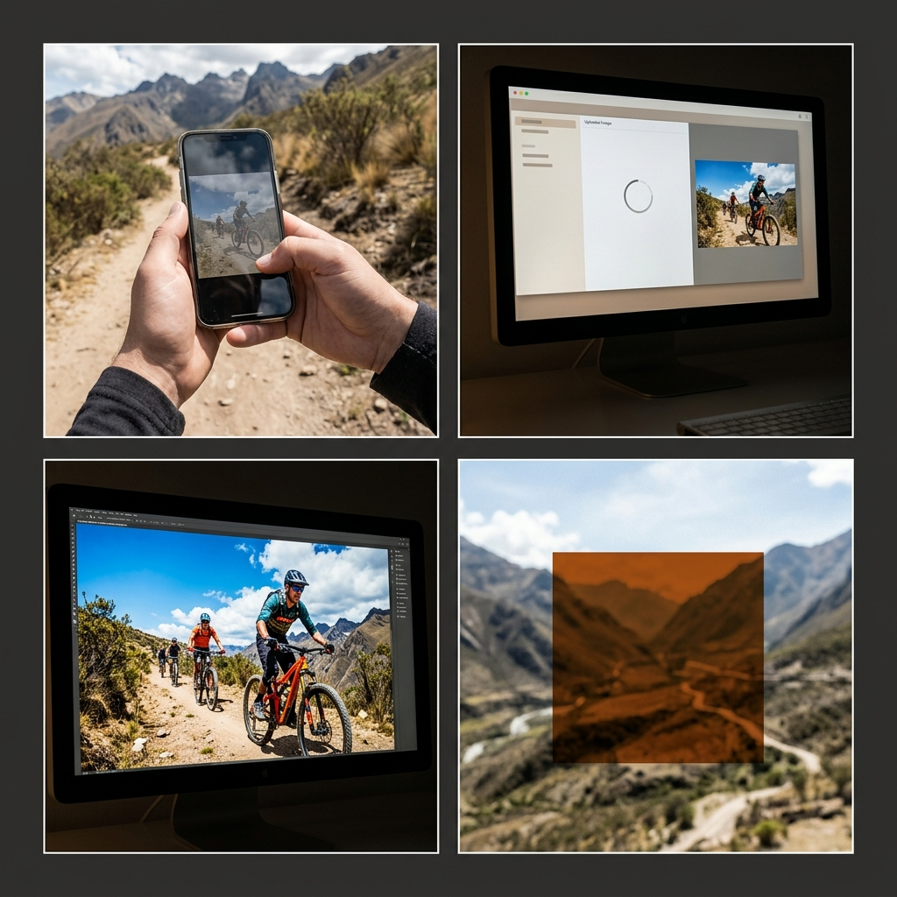

# STORYBOARD
**Proyecto:** Dale Vida a tus Fotos de Ruta
**Reparto (Lore):** none (B-Roll / Genérico)

*Prompt Visual Global (Escenas 1-4)*
*PROMPT:* hyper-realistic, photorealistic live-action, 8k resolution, documentary style. A 4-panel comic-style storyboard layout (2 rows of 2 panels). Panel 1: A close-up POV shot of hands holding a smartphone outdoors on a sunny dirt path in the Andes mountains. The smartphone screen shows a washed-out, dull photo of mountain bikers. Panel 2: A macro shot of a computer monitor displaying a sleek, minimalist Artificial Intelligence chat interface with a text prompt box and a photograph being uploaded. Panel 3: A macro shot of a computer monitor showing a vibrant, highly saturated photograph of mountain bikers on a trail, deep contrast and blue skies. Panel 4: A blurred outdoor shot of an Andean mountain trail, with a large modern abstract graphic block overlay in the center. CRITICAL: Do not include any text, letters, subtitles, words, or speech bubbles anywhere in the image. The image must be completely free of typography.

### Toma 1 (Hook POV Celular)
- **Toma:** 1
- **Thumbnail (Visual):** POV de manos sosteniendo un celular en plena ruta andina seca. La pantalla muestra una foto grupal de ciclistas lavada, grisácea y con el cielo quemado.
- **Acción/Narrativa:** Se presenta el problema de tomar una foto en la montaña con luz dura.
- **Cámara y Fotografía:**
  - **Plano:** POV (Point of View) / ECU al celular.
  - **Movimiento de cámara:** Handheld, tembloroso, rápido.
  - **Iluminación:** Luz dura de mediodía andino, sol cenital.
  - **Color Grading:** Pantalla del celular desaturada, entorno cálido.
- **Duración:** 0:00 - 0:03
- **Audio/Voz en Off:** "¿El paisaje era épico pero la foto salió lavada y sin color?"
- **Transición:** Hard Cut

### Toma 2 (Interfaz Chat IA)
- **Toma:** 2
- **Thumbnail (Visual):** Vemos una interfaz limpia y minimalista de un Chat de Inteligencia Artificial. El usuario arrastra la foto lavada al chat y la IA procesa la imagen.
- **Acción/Narrativa:** Se muestra que la solución es escribir comandos simples de IA, no horas de edición manual.
- **Cámara y Fotografía:**
  - **Plano:** Macro de pantalla (ECU).
  - **Movimiento de cámara:** Fijo.
  - **Iluminación:** Luz de monitor.
  - **Color Grading:** Tonos fríos de interfaz limpia.
- **Duración:** 0:03 - 0:08
- **Audio/Voz en Off:** "La cámara no es el problema. Magia con IA en segundos:"
- **Transición:** Match Cut

### Toma 3 (Antes y Después)
- **Toma:** 3
- **Thumbnail (Visual):** La foto en pantalla completa recuperando contraste y cielos azules.
- **Acción/Narrativa:** El momento de dopamina y alivio visual.
- **Cámara y Fotografía:**
  - **Plano:** Full Screen (Pantalla completa).
  - **Movimiento de cámara:** Ninguno.
  - **Iluminación:** Digital.
  - **Color Grading:** Contraste extremo.
- **Duración:** 0:08 - 0:12
- **Audio/Voz en Off:** "Revelado digital y pum... colores súper vivos."
- **Transición:** Fast Whip Pan

### Toma 4 (Call to Action / Teaser)
- **Toma:** 4
- **Thumbnail (Visual):** El paisaje de Cochabamba se desenfoca. Aparece un bloque gráfico moderno para el CTA.
- **Acción/Narrativa:** Se canaliza la urgencia de inscribirse al taller.
- **Cámara y Fotografía:**
  - **Plano:** Paisaje desenfocado.
  - **Movimiento de cámara:** Fijo.
  - **Iluminación:** Atardecer andino.
  - **Color Grading:** Colores cálidos y vibrantes.
- **Duración:** 0:12 - 0:16
- **Audio/Voz en Off:** "Faltan pocos días para lanzar nuestro Taller de Fotografía IA. Comenta 'LISTA' para asegurar tu espacio."
- **Transición:** Fade to Black
