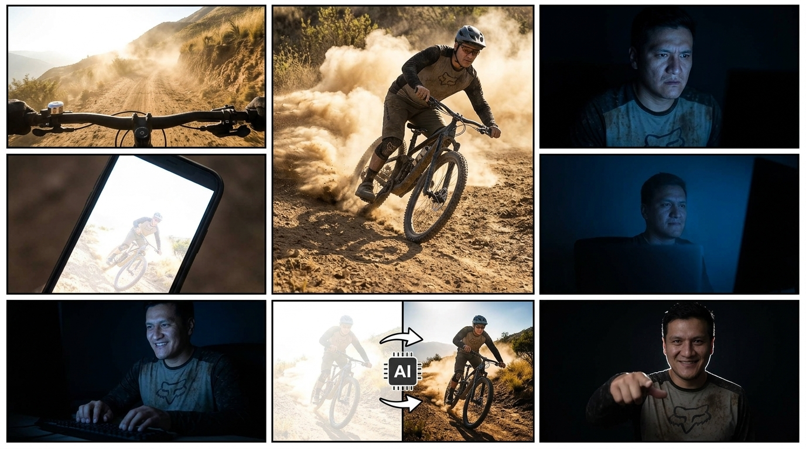

# STORYBOARD: 0002-curso-ia-mtb-bolivia
**Reparto (Lore):** henry-taby (Rol: Ciclista MTB)

### Toma 1 (Hook A: La Rodada GoPro)
- **Toma:** 1
- **Thumbnail (Visual):** Vista en primera persona (POV) del manillar de la bicicleta rodando por un sendero polvoriento a alta velocidad.
- **Acción/Narrativa:** El ciclista rueda a toda velocidad, mostrando la adrenalina pura del ciclismo de montaña (MTB Trail).
- **Cámara y Fotografía:**
  - **Plano:** POV (Point of View) / Lente Ultra Gran Angular (GoPro style, 12mm)
  - **Movimiento de cámara:** Vibración agresiva, Handheld Action.
  - **Iluminación:** Luz solar directa, alto contraste (midday sun).
  - **Color Grading:** Colores cálidos, tonos tierra saturados.
- **Duración:** 0:00 - 0:04
- **Audio/Voz en Off:** *(Voz)* "Te sientes como un piloto profesional en la montaña..." *(SFX)* Llantas derrapando.
- **Transición:** Hard Cut / Fast Cut

### Toma 2 (Hook B: El Derrape)
- **Toma:** 2
- **Thumbnail (Visual):** El ciclista (henry-taby) frena de golpe frente a la cámara, levantando polvo.
- **Acción/Narrativa:** Frenazo agresivo que demuestra habilidad y velocidad.
- **Cámara y Fotografía:**
  - **Plano:** Low Angle (Contrapicado) / Lente Angular (24mm)
  - **Movimiento de cámara:** Fija en el suelo, cámara lenta (Slow-motion 60fps) al final.
  - **Iluminación:** Backlit (Contraluz por el polvo iluminado).
  - **Color Grading:** Tonos cálidos.
- **Duración:** 0:04 - 0:08
- **Audio/Voz en Off:** *(Voz)* "...volando por los senderos y sintiendo la adrenalina." *(SFX)* Derrape.
- **Transición:** Smash Cut (Corte brusco por el sonido de disco rayado).

### Toma 3 (Interrupción: La Decepción)
- **Toma:** 3
- **Thumbnail (Visual):** Primer plano de henry-taby (sin casco, pero con el jersey polvoriento) en su habitación oscura. Su cara muestra decepción pura.
- **Acción/Narrativa:** Ve sus fotos en el monitor y se frustra profundamente.
- **Cámara y Fotografía:**
  - **Plano:** Close Up (CU) / Lente 50mm f/1.8
  - **Movimiento de cámara:** Zoom In rápido (Crash Zoom).
  - **Iluminación:** Chiaroscuro (Luz azul del monitor iluminando su cara, sombras duras en el resto).
  - **Color Grading:** Frío, tonos azulados y cian.
- **Duración:** 0:08 - 0:14
- **Audio/Voz en Off:** *(Voz)* "Pero llegas a casa, revisas la galería..." *(SFX)* ¡Scratch de disco!
- **Transición:** Hard Cut

### Toma 4 (El Problema: La Foto Mala)
- **Toma:** 4
- **Thumbnail (Visual):** Pantalla del celular mostrando una foto de ciclismo arruinada (cielo blanco brillante, encuadre terrible).
- **Acción/Narrativa:** Revelación de la expectativa vs. realidad.
- **Cámara y Fotografía:**
  - **Plano:** Extreme Close Up (ECU) a la pantalla del celular.
  - **Movimiento de cámara:** Ligero temblor de manos (Handheld).
  - **Iluminación:** Propia de la pantalla OLED.
  - **Color Grading:** Foto en sí desaturada, con "blown-out highlights" (cielo sobreexpuesto).
- **Duración:** 0:14 - 0:19
- **Audio/Voz en Off:** *(Voz)* "...y parece que tomaste la foto con una calculadora."
- **Transición:** Hard Cut

### Toma 5 (Solución A: Entra la IA)
- **Toma:** 5
- **Thumbnail (Visual):** Paneo rápido desde el celular hasta la cara de henry-taby, que pasa de la decepción a una sonrisa confiada.
- **Acción/Narrativa:** Empieza a teclear en el teclado, activando su conocimiento tecnológico.
- **Cámara y Fotografía:**
  - **Plano:** Medium Close Up (MCU) / Lente 35mm.
  - **Movimiento de cámara:** Whip Pan (Paneo de barrido rápido).
  - **Iluminación:** Luz de monitor más cálida y brillante (simulando una interfaz blanca/brillante de IA).
  - **Color Grading:** Transición de azul frío a colores neutros/vibrantes.
- **Duración:** 0:19 - 0:25
- **Audio/Voz en Off:** *(Voz)* "Tranquilo. Con un poco de inteligencia artificial..." *(SFX)* Teclado rápido.
- **Transición:** Match Cut

### Toma 6 (Solución B: La Magia)
- **Toma:** 6
- **Thumbnail (Visual):** Animación en pantalla dividida (split-screen slider) mostrando la foto mala arreglándose mágicamente con colores vibrantes y cielo azul.
- **Acción/Narrativa:** Un slider (línea divisoria) se mueve de izquierda a derecha. A la izquierda, la foto original se ve terrible (colores lavados, blanquecina, sin contraste). A la derecha del slider, la imagen revelada es una obra de arte corregida por IA.
- **Cámara y Fotografía:**
  - **Plano:** Screencast (Captura de pantalla limpia).
  - **Movimiento de cámara:** Estático. El único movimiento es el efecto "Wipe" o Slider de edición.
  - **Iluminación:** N/A.
  - **Color Grading:** Lado izquierdo: terriblemente desaturado, lavado, blanco/grisáceo. Lado derecho: Saturación perfecta, "Red Bull Style".
- **Duración:** 0:25 - 0:33
- **Audio/Voz en Off:** *(Voz)* "...puedes rescatar esa foto y dejarla a nivel revista profesional, ¡en segundos!"
- **Transición:** Hard Cut

### Toma 7 (CTA: Comenta RUTA)
- **Toma:** 7
- **Thumbnail (Visual):** henry-taby sonriendo con confianza a cámara y apuntando con el dedo hacia abajo.
- **Acción/Narrativa:** El llamado a la acción final.
- **Cámara y Fotografía:**
  - **Plano:** Medium Shot (MS) / Lente 50mm con fondo ligeramente desenfocado (bokeh).
  - **Movimiento de cámara:** Slow Push-in (Dolly in lento).
  - **Iluminación:** Luz principal suave (Soft Key) con luz de contra azulada (Rim light).
  - **Color Grading:** Contraste moderno, piel natural y vibrante.
- **Duración:** 0:33 - 0:40
- **Audio/Voz en Off:** *(Voz)* "¿Tus fotos dan pena? Comenta 'RUTA' y te paso el curso de IA."
- **Transición:** Fade to Black

---

## 🎨 Prompts Visuales Globales (Para generar Grid de Storyboard)

*LORE GLOSSARY:*
*[henry-taby] = Adult male in his late 30s, wearing high-end MTB cycling gear, technical long-sleeve jersey with dirt and dust. In interior shots, he has no helmet. In exterior shots, half-shell MTB trail helmet with visor and sports sunglasses on the head.*

*PROMPT:*
> A 7-panel comic-style storyboard layout describing a short film about mountain biking and AI photography. Cinematic style, high contrast, GoPro action mixed with moody indoor lighting. 
> Panel 1: POV from mountain bike handlebars riding fast on a scenic mountain dirt trail in the foothills of Cochabamba, very dusty, intense sunlight. 
> Panel 2: Low angle shot of [henry-taby] riding his mountain bike and braking aggressively on a dirt trail. The dust cloud settles down as the bike comes to a full stop.
> Panel 3: Close up of [henry-taby] in a dark room, no helmet but still wearing his dusty jersey, lit only by the blue light of a computer monitor, looking deeply disappointed (chiaroscuro lighting). 
> Panel 4: Extreme close up of a smartphone screen showing a terrible, overexposed, washed-out cycling photo with a white blown-out sky. 
> Panel 5: Medium close up of [henry-taby] in the dark room, smiling confidently as he types on a keyboard, screen light illuminating his face. 
> Panel 6: Split-screen graphic showing a bad washed-out photo on the left and a stunning, perfectly color-graded professional MTB photo on the right. 
> Panel 7: Medium shot of [henry-taby] pointing downwards at the camera with a confident smile, nice rim light on his shoulders.
> CRITICAL: Do not include any text, letters, subtitles, words, or speech bubbles anywhere in the image. The image must be completely free of typography.

