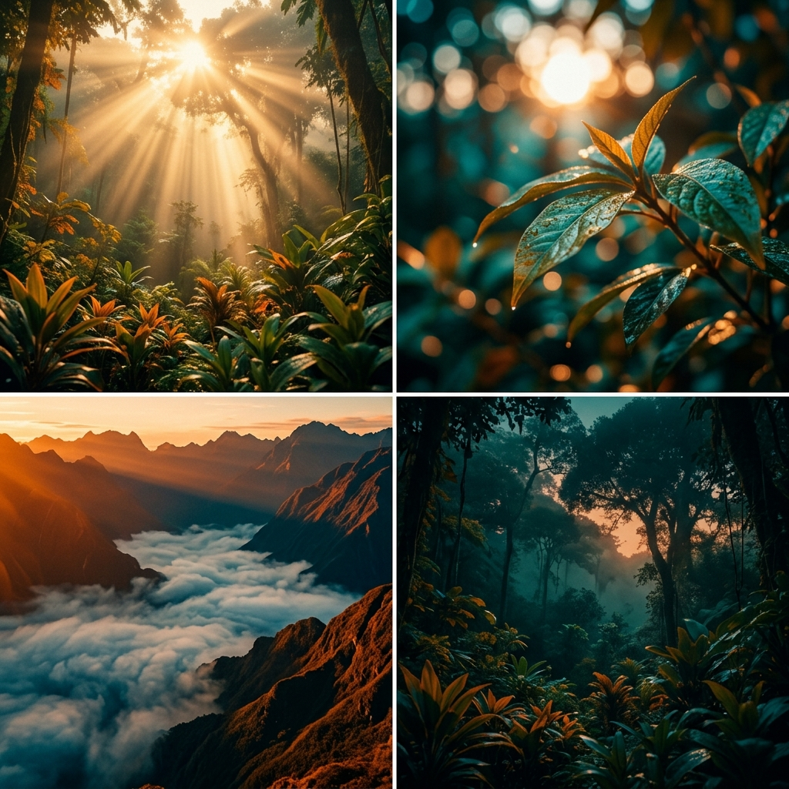

# Storyboard: El refugio en el caos
**Reparto (Lore):** none (B-Roll Genérico sin personaje en pantalla)

## Bloque 1: Escenas 1 a 4

*PROMPT VISUAL GLOBAL:*
*PROMPT:* A 4-panel comic-style storyboard layout (2 rows of 2 panels). Style: Cinematic High-End Commercial, dramatic golden hour lighting, heavy contrast, Teal and Orange color grading, subtle film grain, photorealistic, ARRI Alexa look, hyper-realistic nature. CRITICAL: Do not include any text, letters, subtitles, words, or speech bubbles anywhere in the image. The image must be completely free of typography. Panel 1: POV shot moving slowly into a lush tropical cloud forest clearing. Intense golden sun rays piercing through thick fog (volumetric god rays). Panel 2: Macro detail shot of wet tropical leaves. The sun is out of focus behind them creating a perfect deep bokeh (ARRI lens effect). Panel 3: Epic wide shot floating above low clouds in a mountainous valley. The mountains are submerged in deep orange and blue hues. Panel 4: The same tropical cloud forest as Panel 1, but the golden light is fading into darkness (dusk), very serene.

### Toma 1 (Hook - Entrada al claro)
- **Toma:** 1
- **Thumbnail (Visual):** Vista POV avanzando lentamente hacia un claro en el bosque nuboso de los Yungas, luz dorada cruzando la niebla.
- **Acción/Narrativa:** El espectador es introducido a un refugio natural de manera lenta e inmersiva.
- **Cámara y Fotografía:**
  - **Plano:** POV (Wide Angle) / Lente 24mm, f/2.8
  - **Movimiento de cámara:** Dolly In ultra-lento y estabilizado.
  - **Iluminación:** Golden Hour intensa, God Rays volumétricos.
  - **Color Grading:** Teal & Orange natural.
- **Duración:** 0:00 - 0:03 (3s)
- **Audio/Voz en Off:** "(SFX) Viento suave... El mundo va demasiado rápido hoy..."
- **Transición:** Match Cut (por movimiento lento)

### Toma 2 (Desarrollo - Pausa y Respiración)
- **Toma:** 2
- **Thumbnail (Visual):** Plano detalle macro de hojas tropicales húmedas moviéndose con la brisa, sol desenfocado al fondo.
- **Acción/Narrativa:** Freno total a la acción. Se enfoca en los pequeños detalles orgánicos.
- **Cámara y Fotografía:**
  - **Plano:** Macro / Lente 100mm, f/1.4 (Bokeh profundo).
  - **Movimiento de cámara:** Slow Dolly-In milimétrico e inmersivo.
  - **Iluminación:** Contraluz suave con destellos intensificándose al final.
  - **Color Grading:** Tonos verdes esmeralda cálidos.
- **Duración:** 0:03 - 0:08 (5s)
- **Audio/Voz en Off:** "(SFX) Gota cayendo... Hagamos una pausa."
- **Transición:** Match Cut (El destello de luz inunda la lente y conecta con el sol de la Toma 3)

### Toma 3 (Revelación - Mar de Nubes)
- **Toma:** 3
- **Thumbnail (Visual):** Plano general épico de montañas en los Yungas sobre un mar de nubes bajas al atardecer.
- **Acción/Narrativa:** Expansión visual que transmite paz y pequeñez frente a la naturaleza.
- **Cámara y Fotografía:**
  - **Plano:** Wide Aerial Shot / Drone.
  - **Movimiento de cámara:** Vuelo estático suspendido o avance milimétrico.
  - **Iluminación:** Luz rasante de atardecer profundo.
  - **Color Grading:** Contraste fuerte azul profundo y naranja.
- **Duración:** 0:08 - 0:12 (4s)
- **Audio/Voz en Off:** "(SFX) Drone cálido... Solo respira."
- **Transición:** Corte directo (Hard Cut)

### Toma 4 (CTA - Desvanecimiento)
- **Toma:** 4
- **Thumbnail (Visual):** El bosque inicial pero oscureciéndose suavemente (atardecer a noche).
- **Acción/Narrativa:** Fin del refugio, dejando una sensación de calma y seguridad para volver.
- **Cámara y Fotografía:**
  - **Plano:** Wide Shot / Fijo.
  - **Movimiento de cámara:** Fijo completamente.
  - **Iluminación:** Golden Hour que se apaga (Fade).
  - **Color Grading:** Tonos fríos invadiendo los cálidos.
- **Duración:** 0:12 - 0:15 (3s)
- **Audio/Voz en Off:** "(SFX) Viento cesando... Si necesitabas este descanso, ya sabes dónde encontrarlo."
- **Transición:** Fade to Black
