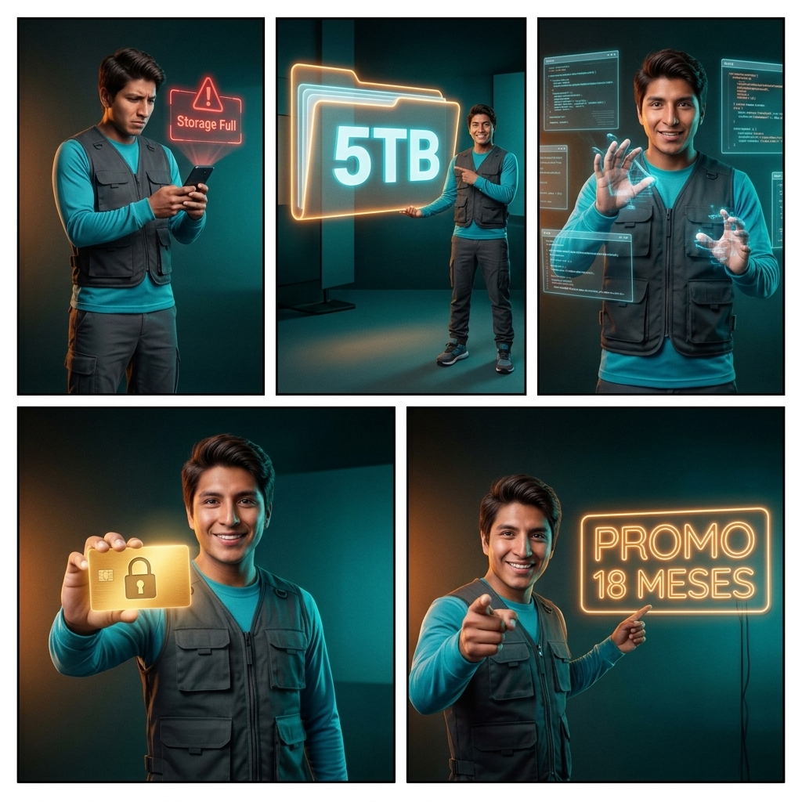

# Storyboard Técnico: Promo Gemini Pro + 5TB

**Reparto (Lore):** Arturo (Guía tecnológico, 28 años, boliviano, optimista, camisa azul brillante, chaleco táctico negro)

## Bloque 1 (Escenas 1-5)

### Toma 1 (El Gancho - Dolor y Solución)
- **Toma:** 1
- **Thumbnail (Visual):** Arturo mirando su teléfono frustrado. Una alerta holográfica roja dice "Storage Full". Luego sonríe a cámara.
- **Acción/Narrativa:** Arturo mira su teléfono frustrado por la falta de espacio, luego mira a cámara con confianza y sonríe, chasqueando los dedos.
- **Cámara y Fotografía:**
  - **Plano:** Medium Shot (MS)
  - **Movimiento de cámara:** Smooth push-in
  - **Iluminación:** Dramatic chiaroscuro lighting, tech-lab vibes
  - **Color Grading:** Teal and Orange, high contrast
- **Duración:** 0:00 - 0:04
- **Audio/Voz en Off:** "¿Quieres 5 Terabytes de espacio real y la mejor IA del mercado en tu propia cuenta? ¡Presta atención!"
- **Transición:** Match Cut (chasquido a señalar)

### Toma 2 (El Almacenamiento - Beneficio Físico/Digital)
- **Toma:** 2
- **Thumbnail (Visual):** Arturo señala una enorme carpeta holográfica "5TB". Siluetas brillantes detrás.
- **Acción/Narrativa:** Arturo señala orgulloso una carpeta holográfica masiva de 5TB. Siluetas de familiares se iluminan.
- **Cámara y Fotografía:**
  - **Plano:** Medium-full shot (MFS)
  - **Movimiento de cámara:** Dynamic slight zoom out
  - **Iluminación:** Neon cyan and blue accents
  - **Color Grading:** Teal and Orange, vibrant
- **Duración:** 0:04 - 0:08
- **Audio/Voz en Off:** "Obtén 5 Terabytes en Google Drive para todas tus fotos, videos, proyectos... ¡y compártelo con hasta 5 personas!"
- **Transición:** Whip pan

### Toma 3 (Gemini Pro - El Cerebro)
- **Toma:** 3
- **Thumbnail (Visual):** Arturo interactuando a lo Minority Report con pantallas de código.
- **Acción/Narrativa:** Arturo interactúa rápidamente con múltiples pantallas holográficas flotantes, luciendo asombrado y emocionado.
- **Cámara y Fotografía:**
  - **Plano:** Close-up (CU)
  - **Movimiento de cámara:** Fast, energetic motion
  - **Iluminación:** Cinematic sci-fi lighting
  - **Color Grading:** Teal and Orange
- **Duración:** 0:08 - 0:12
- **Audio/Voz en Off:** "Además, desbloquea Gemini Pro. Tu agente inteligente que redacta, resume, analiza datos y entiende código al instante."
- **Transición:** Fast Whip Pan

### Toma 4 (Seguridad y Activación - Confianza)
- **Toma:** 4
- **Thumbnail (Visual):** Arturo sostiene tarjeta dorada con un candado brillante frente a la cámara.
- **Acción/Narrativa:** Arturo muestra una tarjeta dorada con un candado brillante, asintiendo a cámara para inspirar confianza.
- **Cámara y Fotografía:**
  - **Plano:** Medium close-up (MCU)
  - **Movimiento de cámara:** Smooth tracking
  - **Iluminación:** Professional corporate lighting, glowing card
  - **Color Grading:** Teal and Orange, bokeh background
- **Duración:** 0:12 - 0:16
- **Audio/Voz en Off:** "Privacidad total. Activación inmediata en tu propia cuenta personal, nada de perfiles compartidos. Tu información está segura."
- **Transición:** Swish Pan

### Toma 5 (El Cierre y Llamado a la Acción - Urgencia)
- **Toma:** 5
- **Thumbnail (Visual):** Arturo apunta a la cámara entusiasta. Fondo con letrero "PROMO 18 MESES".
- **Acción/Narrativa:** Arturo señala a cámara, asiente con entusiasmo y simula un "clic" con la mano. Fondo con anuncio de "PROMO 18 MESES".
- **Cámara y Fotografía:**
  - **Plano:** Medium shot (MS)
  - **Movimiento de cámara:** Fast-paced, high energy
  - **Iluminación:** High key lighting, vibrant
  - **Color Grading:** Teal and Orange, hyper-realistic
- **Duración:** 0:16 - 0:20
- **Audio/Voz en Off:** "Disfruta de 12 meses, ¡o entra en nuestra promoción exclusiva de 18 meses! Escríbenos por WhatsApp y actívalo hoy mismo."
- **Transición:** Fade to black

---

*LORE GLOSSARY:*
*[arturo] = 28-year-old Bolivian adult male, short brown hair, wearing a bright blue long-sleeve shirt and black tactical vest. Highly detailed, photorealistic.*

*PROMPT VISUAL GLOBAL:*
*PROMPT:* A 5-panel comic-style storyboard layout (2 rows). Cinematic High-End Commercial style, dramatic chiaroscuro lighting, Teal and Orange color grading, subtle film grain. INT. ESTUDIO HIGH-TECH. Panel 1: [arturo] looking at his phone frustrated, a red holographic warning "Storage Full". Panel 2: [arturo] pointing proudly at a massive glowing "5TB" holographic folder. Panel 3: Close up of [arturo] interacting energetically with floating holographic code screens. Panel 4: [arturo] holding a glowing golden card with a padlock icon towards the camera. Panel 5: [arturo] pointing enthusiastically at the viewer, pointing to "PROMO 18 MESES" neon sign. CRITICAL: Do not include any text, letters, subtitles, words, or speech bubbles anywhere in the image. The image must be completely free of typography.

