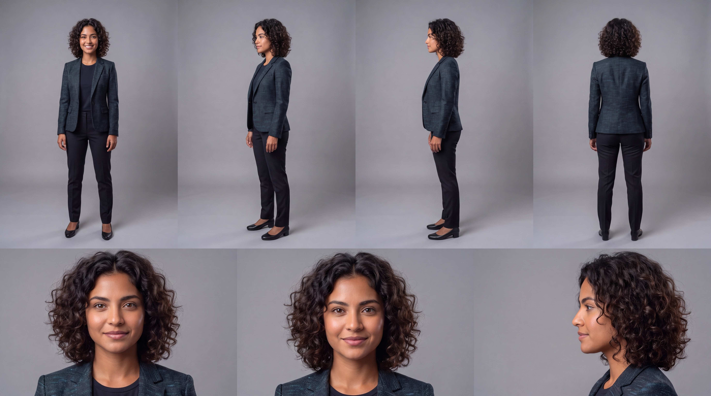
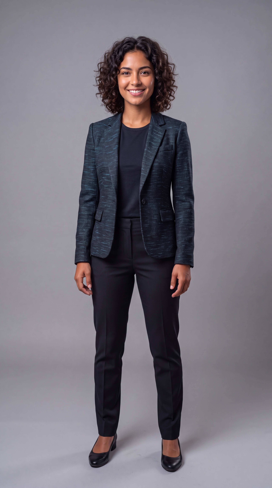

# CASTING ROLE: Podcaster

**Actor Base:** Camila
**Proyecto:** 0002-5-cosas-gemini

## 🎭 Contexto en el Guion
**Actitud / Emoción:** Carismática, confiada, cómplice y muy asertiva.
**Vestuario (Wardrobe):** Traje sastre moderno (Blazer) en tono oscuro elegante, pero con sutiles hilos o acentos en color cian y teal (los colores corporativos de NOVA) tejidos discretamente en la tela del traje. Debajo, una playera oscura.

## 📸 Prompt para Hoja de Referencia (Character Reference Sheet)
*Copia y pega este prompt en tu IA generadora de imágenes:*
> **PROMPT EN INGLÉS:** Create a professional character reference sheet based strictly on the loaded reference image. Use a clean, neutral, and smooth background. Present the sheet as a technical model turnaround, maintaining exactly the same visual style, level of realism, rendering focus, textures, color treatment, and general aesthetics as the reference.
> 
> **Subject Description:** 28-year-old Bolivian adult female, wearing a modern stylish dark tailored blazer with subtle cyan and teal threading woven into the fabric, over a dark t-shirt, matching dark tailored trousers, and elegant office shoes, short neat hair, charismatic expression.
> 
> **Composition:** Organize in two horizontal rows.
> - **Top row:** Four full-body standing views side-by-side in this order: front view, left profile view, right profile view, back view.
> - **Bottom row:** Three high-detail close-up portraits aligned under the full-body row in this order: front portrait, left profile portrait, right profile portrait.
> 
> **Technical constraints:** Maintain perfect identity consistency across all panels. Place the character in a relaxed A-pose, with consistent scale, precise anatomy, and clear silhouette. Ensure uniform spacing, clean separation between panels, consistent head height across the top row, and consistent facial scale on the bottom row.
> **Lighting:** Coherent across all panels (same direction, intensity, and softness), with natural controlled shadows that preserve detail without dramatic changes in atmosphere. Sharp, print-ready, well-defined details.

## 📸 Prompt para Imagen Frontal (Google Flow Face / Cuerpo Entero)
> **PROMPT EN INGLÉS:** A hyper-realistic full-body front-facing portrait of the subject in the loaded reference image. 28-year-old Bolivian adult female, wearing a modern stylish dark tailored blazer with subtle cyan and teal threading woven into the fabric, over a dark t-shirt, matching dark tailored trousers, and elegant office shoes. She has a charismatic, confident smile, looking directly at the camera, standing in a relaxed pose. Clean, neutral gray background. Soft cinematic studio lighting, highly detailed face, natural skin texture and pores. Shot on ARRI Alexa 65, 8k resolution.

## 🤖 Configuración para Google Flow (Character Info)
*Si vas a guardar este personaje en Google Flow u otra plataforma similar, usa estos datos:*

**Name:** `Camila_Podcast_Host`
**Character Info:** `28-year-old Bolivian adult female, wearing a modern stylish dark tailored blazer with subtle cyan and teal threading/accents woven into the fabric over a dark t-shirt. Short neat hair.`

## 🗣️ Configuración de Voz (Google Flow)
**Voice Name:** `Mujer 3 (Standard Female AI Voice)`
**Customize Performance:** `Speak in neutral Latin American Spanish. Confident, energetic and intimate podcast female tone.`
