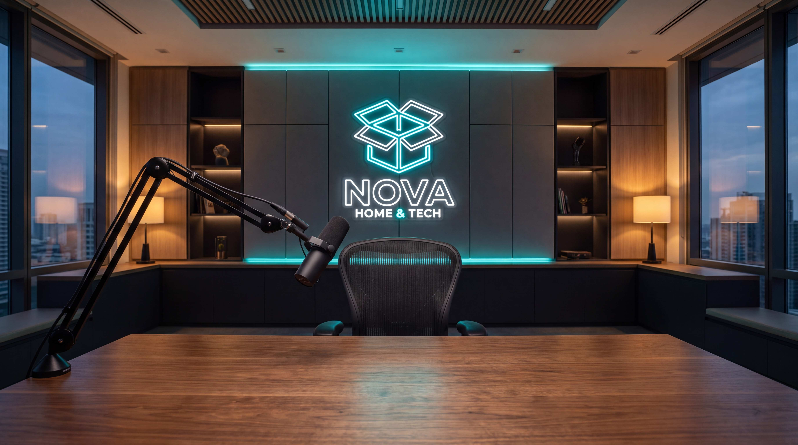

# LOCATION / SET PROMPT: Podcast Studio

**Nombre del Set:** NOVA Office Studio (Vodcast)
**Ubicación:** `workspaces/nova/projects/0002-5-cosas-gemini/sets/set_01_podcast_studio.md`

## 🎬 Prompt de Generación (Image-to-Image / Style Reference)

Para generar el escenario vacío perfecto que servirá de fondo (Background Plate) en todas las tomas de este proyecto, utiliza el siguiente prompt hiper-realista.

**⚠️ INSTRUCCIÓN CRÍTICA (LOGO REF):**
Debes pasarle al motor de IA (Midjourney/Imagen3) el archivo `workspaces/nova/assets/nova-logo-1000x1000.png` como referencia de imagen (Image Prompt / Cref) para que integre la forma del logo en el set.

**[ENGLISH PROMPT]**
Perfect front-facing, symmetrical wide camera angle. An empty modern high-end podcast studio setup. In the foreground, a sleek wooden desk with a professional black broadcast microphone (Shure SM7B style) mounted on a boom arm. The background is a modern corporate tech office wall. On the background wall, there is a perfectly defined, undistorted, elegant glowing neon sign that perfectly mimics the shape of the provided reference logo. Every element from foreground to background is in perfectly sharp focus (deep depth of field, f/11 aperture, no blur, no bokeh). The lighting is cinematic and moody, featuring warm ambient office tones contrasting with subtle neon cyan and teal lighting accents (NOVA brand colors). Ultra-realistic, cinematic High-End Podcast style, shot on ARRI Alexa 65, 8k resolution, photorealistic architecture. NO PEOPLE. EMPTY CHAIR.

## ⚙️ Parámetros Técnicos
- **Aspect Ratio:** 9:16 (Vertical) o 16:9 (Horizontal para recortes)
- **Negative Prompt:** People, humans, text, letters, typography, cartoon, 3d render, messy cables, blur, bokeh, out of focus.

## 🖼️ Muestra Generada (Test de Prompt)

