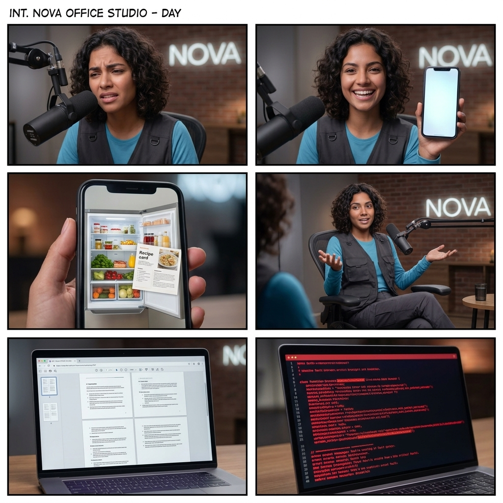
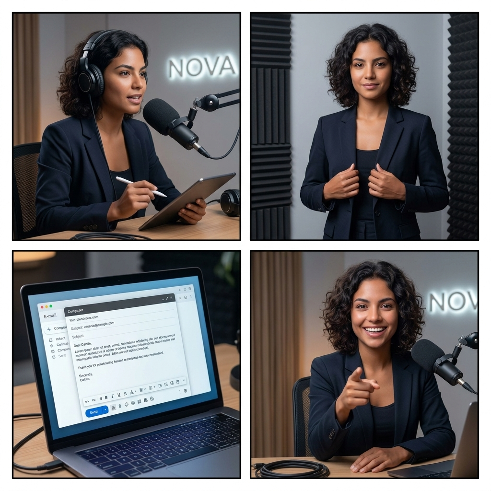

# Storyboard Técnico: 5 Cosas Mind-Blowing con Gemini AI

**Reparto (Lore):** Camila (Guía tecnológica, 28 años, podcaster experta en NOVA)

## Bloque 1 (Tomas 1 a 6A)

### Toma 1 (El Gancho - Romper el Patrón - Humor)
- **Toma:** 1
- **Thumbnail (Visual):** Camila negando con la cabeza cerca del micrófono Shure SM7B, luego sonríe con complicidad haciendo un gesto de "basta".
- **Acción/Narrativa:** Se inclina hacia el micrófono decepcionada por los que usan Google Search, luego sonríe.
- **Cámara y Fotografía:**
  - **Plano:** Medium Close-up (MCU)
  - **Movimiento de cámara:** Zoom In rápido
  - **Iluminación:** Soft studio lighting, cinematic
  - **Color Grading:** Warm office tones con luces teal/cyan
- **Duración:** 0:00 - 0:04
- **Audio/Voz en Off:** "¿Sigues usando el buscador de Google para todo? Amigo, eso es como volver con tu ex... ¡Superalo! Entra a Gemini y haz estas 5 cosas gratis."
- **Transición:** Zoom In rápido

### Toma 2A (Truco 1 - Camila)
- **Toma:** 2A
- **Thumbnail (Visual):** Camila levanta su teléfono mostrando la pantalla hacia la cámara.
- **Acción/Narrativa:** Presenta el primer truco.
- **Cámara y Fotografía:**
  - **Plano:** Medium Shot (MS)
  - **Movimiento de cámara:** Fijo
  - **Iluminación:** Soft studio lighting
  - **Color Grading:** Warm office tones
- **Duración:** 0:04 - 0:07
- **Audio/Voz en Off:** "Uno: Tómale una foto a tu refri casi vacío."
- **Transición:** Hard Cut

### Toma 2B (Truco 1 - Pantalla B-Roll)
- **Toma:** 2B
- **Thumbnail (Visual):** Interfaz limpia del chat de Gemini en un celular, procesando una foto de un refrigerador.
- **Acción/Narrativa:** B-Roll mostrando la foto de la nevera y Gemini respondiendo con una receta gourmet.
- **Cámara y Fotografía:**
  - **Plano:** Full Screen UI / Close up to phone
  - **Movimiento de cámara:** Scroll down suave
  - **Iluminación:** Screen glow
  - **Color Grading:** Natural digital
- **Duración:** 0:07 - 0:12
- **Audio/Voz en Off:** "Súbela al chat de Gemini y dile: '¿Qué ceno con esto?'. Te armará una receta gourmet paso a paso en segundos."
- **Transición:** Swipe rápido

### Toma 3A (Truco 2 - Camila)
- **Toma:** 3A
- **Thumbnail (Visual):** Camila gesticulando relajada en su silla de podcast, sonriendo.
- **Acción/Narrativa:** Camila hace un gesto de restarle importancia a la lectura pesada.
- **Cámara y Fotografía:**
  - **Plano:** Medium Shot (MS)
  - **Movimiento de cámara:** Ligero paneo
  - **Iluminación:** Soft studio lighting
  - **Color Grading:** Warm office tones
- **Duración:** 0:12 - 0:15
- **Audio/Voz en Off:** "Dos: Olvídate de leer PDFs de 50 páginas."
- **Transición:** Cut

### Toma 3B (Truco 2 - Pantalla B-Roll)
- **Toma:** 3B
- **Thumbnail (Visual):** Animación de un documento PDF grande siendo arrastrado a la caja de texto de Gemini.
- **Acción/Narrativa:** B-Roll de laptop grabando Gemini.
- **Cámara y Fotografía:**
  - **Plano:** Full Screen UI / Screen recording style
  - **Movimiento de cámara:** Fijo en pantalla
  - **Iluminación:** Screen glow
  - **Color Grading:** Natural digital
- **Duración:** 0:15 - 0:20
- **Audio/Voz en Off:** "Arrastra el archivo y dile: 'Resume esto en 3 viñetas para mi jefe'. Magia instantánea."
- **Transición:** Whip Pan lateral

### Toma 4A (Truco 3 - El Problema B-Roll)
- **Toma:** 4A
- **Thumbnail (Visual):** Un monitor mostrando un error de código crítico en rojo brillante (Dark mode).
- **Acción/Narrativa:** Se muestra el problema frustrante.
- **Cámara y Fotografía:**
  - **Plano:** Close-Up a pantalla
  - **Movimiento de cámara:** Dinámico, slight push in
  - **Iluminación:** Pantalla oscura con neón rojo
  - **Color Grading:** High contrast
- **Duración:** 0:20 - 0:24
- **Audio/Voz en Off:** "Tres: ¿Atascado con código rojo o tareas complejas?" *(SFX: Error buzzer suave / Teclado rápido)*
- **Transición:** Glitch transition sutil *(SFX: Glitch digital)*

### Toma 4B (Truco 3 - La Solución B-Roll)
- **Toma:** 4B
- **Thumbnail (Visual):** Logo de Gemini brillante resolviendo el problema con texto simple.
- **Acción/Narrativa:** Gemini trae la solución de forma amigable.
- **Cámara y Fotografía:**
  - **Plano:** Close-Up a pantalla
  - **Movimiento de cámara:** Fijo
  - **Iluminación:** Pantalla brillante con luz azul/cian
  - **Color Grading:** Clean digital
- **Duración:** 0:24 - 0:28
- **Audio/Voz en Off:** "Tómale foto y dile 'Explícame este error como a un niño de 5 años'." *(SFX: Ascending synth chord - Éxito)*
- **Transición:** Hard Cut

---
*LORE GLOSSARY:*
*[camila] = 28-year-old Bolivian woman, charismatic tech guide. She is wearing smart-casual tech-wear (a stylish dark blazer over a cyan/teal t-shirt). Photorealistic human, pores, natural skin texture, lifelike microexpressions.*

*PROMPT VISUAL GLOBAL BLOQUE 1:*
*PROMPT:* A 6-panel comic-style storyboard layout (2 rows of 3 panels). Ultra-realistic cinematic High-End Podcast style, soft studio lighting. INT. NOVA OFFICE STUDIO - DAY. Subtle glowing NOVA logo on the wall. Panel 1: [camila] leaning closely into a professional black broadcast microphone (Shure SM7B style), shaking her head disappointed. Panel 2: [camila] smiling and holding up a modern smartphone. Panel 3: A close up of a glowing smartphone screen showing a photo of a fridge and a recipe. Panel 4: [camila] sitting back relaxed in her podcast chair, gesturing with hands. Panel 5: A close up of a laptop screen showing a PDF document. Panel 6: A close up of a glowing laptop screen showing red code errors. CRITICAL: Do not include any text, letters, subtitles, words, or speech bubbles anywhere in the image. The image must be completely free of typography.

---

## Bloque 2 (Tomas 5 a 7)

### Toma 5 (Truco 4 - Camila)
- **Toma:** 5
- **Thumbnail (Visual):** Camila se pone auriculares over-ear. Se acerca mucho al micrófono de podcast.
- **Acción/Narrativa:** Camila muestra cómo usar el modo voz inmersivo.
- **Cámara y Fotografía:**
  - **Plano:** Medium Shot (MS)
  - **Movimiento de cámara:** Push in lento
  - **Iluminación:** Soft studio lighting
  - **Color Grading:** Warm office tones
- **Duración:** 0:28 - 0:36
- **Audio/Voz en Off:** "Cuatro: En tu celular usa Gemini Live, el modo de voz. Dile: 'Entrevístame en inglés para un puesto de marketing y dame feedback'. Es tu coach personal."
- **Transición:** Corte seco

### Toma 6A (Truco 5 - Camila)
- **Toma:** 6A
- **Thumbnail (Visual):** Camila acomodándose el blazer, luciendo muy profesional.
- **Acción/Narrativa:** Transición al tip profesional.
- **Cámara y Fotografía:**
  - **Plano:** Medium-Full Shot (MFS)
  - **Movimiento de cámara:** Fijo
  - **Iluminación:** Soft studio lighting
  - **Color Grading:** Warm office tones
- **Duración:** 0:36 - 0:39
- **Audio/Voz en Off:** "Y cinco: Redactar correos incómodos."
- **Transición:** Cut

### Toma 6B (Truco 5 - Pantalla B-Roll)
- **Toma:** 6B
- **Thumbnail (Visual):** Pantalla de laptop autocompletando un correo electrónico asertivo rápidamente.
- **Acción/Narrativa:** B-Roll de Gemini escribiendo el correo de aumento de sueldo.
- **Cámara y Fotografía:**
  - **Plano:** Full Screen UI
  - **Movimiento de cámara:** Fijo
  - **Iluminación:** Screen glow
  - **Color Grading:** Natural digital
- **Duración:** 0:39 - 0:44
- **Audio/Voz en Off:** "Escribe en la web: 'Gemini, ayúdame a pedir un aumento de sueldo con tono profesional'. Te salvará la vida."
- **Transición:** Push in suave

### Toma 7 (Cierre CTA)
- **Toma:** 7
- **Thumbnail (Visual):** Camila apuntando a cámara sonriendo. El logo de NOVA brilla detrás.
- **Acción/Narrativa:** Llamado a la acción rápido y contundente.
- **Cámara y Fotografía:**
  - **Plano:** Medium Shot (MS)
  - **Movimiento de cámara:** Fijo
  - **Iluminación:** Soft studio lighting
  - **Color Grading:** Warm office tones
- **Duración:** 0:44 - 0:50
- **Audio/Voz en Off:** "La inteligencia artificial es tu aliada. Entra a Gemini, pruébalos hoy y síguenos en Nova."
- **Transición:** Fade to black rápido con sonido de "clic"

---

*PROMPT VISUAL GLOBAL BLOQUE 2:*
*PROMPT:* A 4-panel comic-style storyboard layout (2 rows of 2 panels). Ultra-realistic cinematic High-End Podcast style, soft studio lighting. INT. NOVA OFFICE STUDIO - DAY. Subtle glowing NOVA logo on the wall. Panel 1: [camila] wearing sleek over-ear headphones, speaking closely into a broadcast microphone. Panel 2: [camila] adjusting her stylish dark blazer, looking professional. Panel 3: Close up of a laptop screen glowing with an email draft. Panel 4: [camila] pointing directly and enthusiastically at the viewer, smiling genuinely. CRITICAL: Do not include any text, letters, subtitles, words, or speech bubbles anywhere in the image. The image must be completely free of typography.

